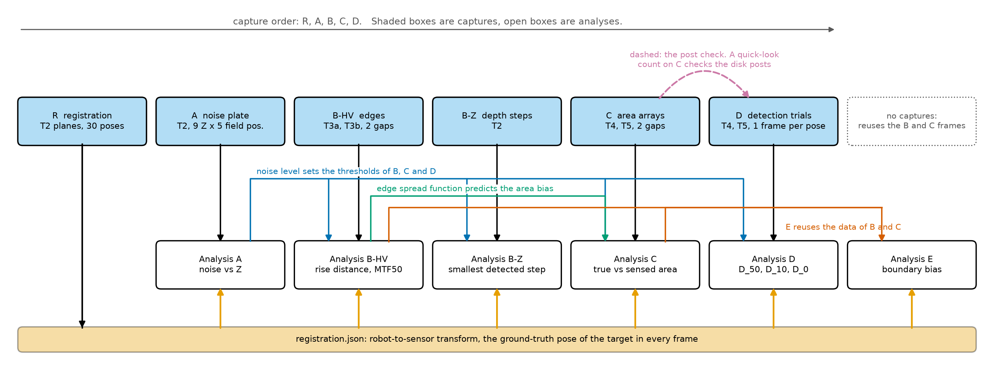
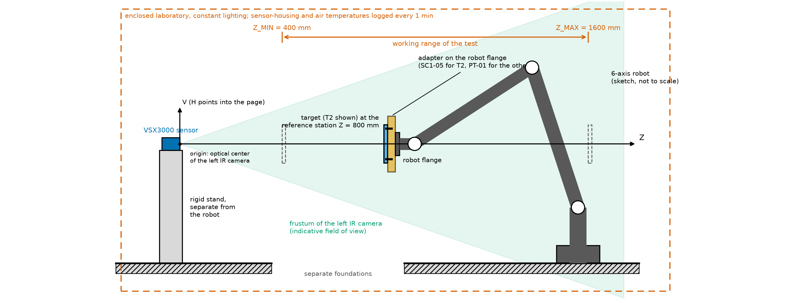
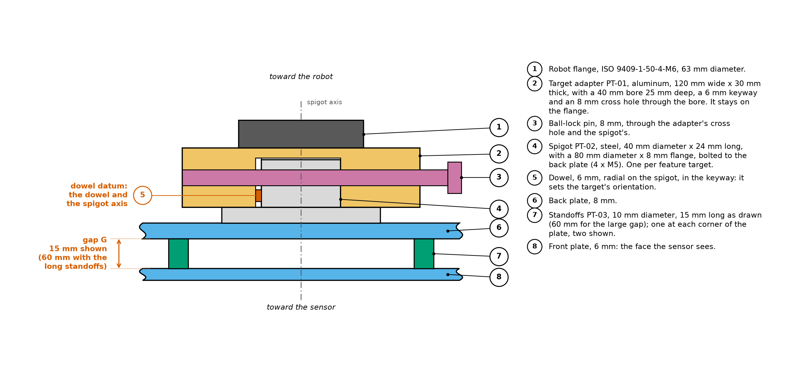
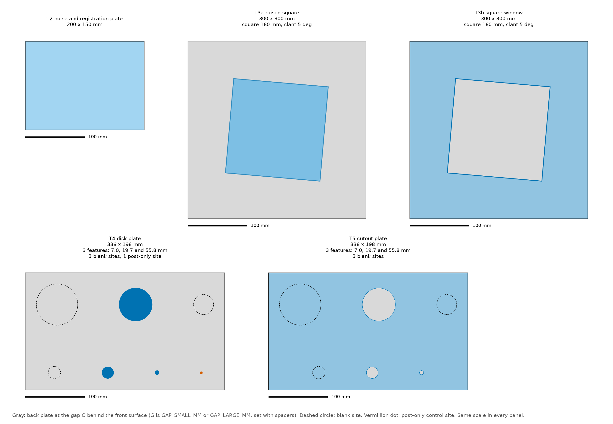
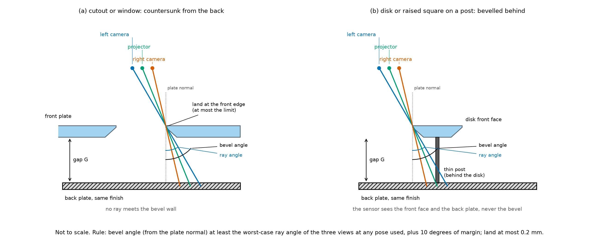
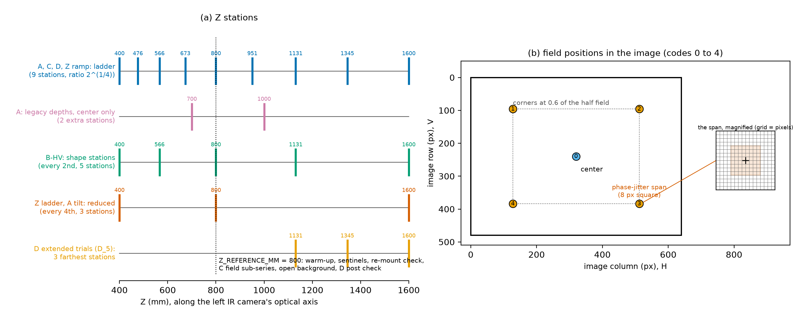
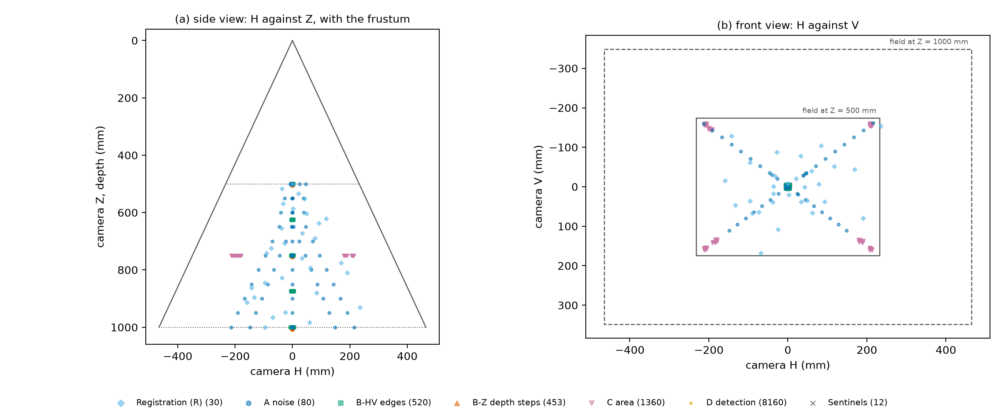
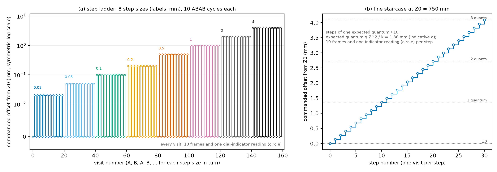
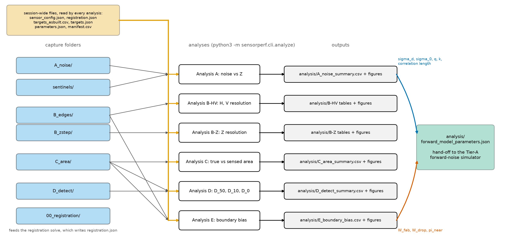

# VSX3000 sensor performance testing: step-by-step procedure

Audience: the robot technician and the test engineer. The technician mounts the targets, programs the robot, and records the captures. No knowledge of the analysis math is needed. Where a step says "run", a computer with Python and this repository is needed (appendix C says how to set it up). The steps that need the engineer are marked "Engineer": filling in the sensor values from the SDK or datasheet (§3), the hand-eye solve and its acceptance (§4), choosing the sensor configuration and any filters-off repeat (§3), the post check for series D (§10), the as-built measurements of the targets (§2), and running the analyses (§14). In this document, "§" followed by a number means that section of this document.

What you are producing: a session folder of sensor capture files (`.mc`), one group of files per robot pose, with a table (the manifest) that says, for every file, which target was in view, where the robot had put it, and what the environment was. The specification calls this the data logging of its Section 9. The analysis software reads the manifest, not the file names. If the manifest is wrong, the results are wrong, so much of this procedure is about getting the table right.

The analysis definitions (what is computed from the captures) are in the characterization procedure specification of 2026-10-04. This document is the step-by-step rendering of its Part I (acquisition) plus a guide to running the analyses of its Part II. It does not repeat the math. "Specification Section N" means that section of the specification.

The order of the five capture series, and what each analysis needs from the others, is in Figure 1. Figure 2 and Figure 3 (§1) show the setup and the target mounting stack. Figure 4 and Figure 5 (§2) show the targets and their chamfered edges. Figure 6 and Figure 7 (§5) show the stations and the planned poses. Figure 8 (§8) shows the depth-step visits, and Figure 9 (§13) shows how the session folder feeds the analyses.



Figure 1. Procedure order and data dependencies. Shaded boxes are captures and open boxes are analyses. Registration poses feed every analysis, the noise level from A sets the thresholds of B, C and D, the edge spread function from B predicts the area bias measured in C, and E reuses the B and C frames. The quick-look count on C data checks the disk posts before D (dashed).

---

## 1. Scope of work and equipment

This section is the complete list of what must exist before the first session: what is already in hand, what must be built, what must be bought, and what must be prepared. Nothing outside this list is needed. The board, its adapter, the run-out fixture and the rigid sensor mount come from the stage-1 calibration project and the registration project; 1b says what they are, so that they can be made for this procedure alone if those projects have not been run. Appendix F holds the shop drawings; appendix E lists suppliers. The robot model is not yet chosen, so every flange part is drawn to the ISO 9409-1-50-4-M6 interface and nothing in this document depends on the model.

The sensor stays fixed. The robot carries the target, so every target pose is commanded, repeatable, and logged. Figure 2 shows the arrangement.



Figure 2. The experimental setup, side view. The sensor stands on its own rigid stand, separate from the robot. The robot carries the target on the target adapter anywhere between Z_MIN and Z_MAX. The laboratory is enclosed and its lighting is constant.

### 1a. Already in hand

| Item | Requirement |
|---|---|
| Sensor | The VSX3000 to be characterized, on the rigid sensor mount of the stage-1 project (a stiff bracket, not a tripod, mechanically separate from the robot base, on an isolated floor or table, its position marked so a bump is noticed); robot motion must not move the sensor |
| Robot | Six-axis industrial robot, model not yet chosen, with an ISO 9409-1-50-4-M6 tool flange (confirm against the chosen robot's flange drawing before the adapter is machined); repeatability {{VALUE:robot_repeatability_mm}} mm or better (ISO 9283); reports its actual, encoder-derived pose at 0.01 mm resolution, time-stamped against the frames; approach-from-below moves programmable; payload above the heaviest target with its adapter (about {{DERIVED:heaviest_target_kg}} kg) |
| Capture computer and software | VSX3000 SDK, the LRVisionLibs `MatCloud` reader, and the robot interface that logs the actual pose read back from the robot; accepts the capture trigger from the robot program and writes one `.mc` file group per pose, named by pose id (§11); at least {{DERIVED:disk_gb_per_1000_frames}} GB free per 1,000 frames, about {{DERIVED:disk_gb_session}} GB for the default plan |
| Analysis computer | Any computer with Python 3.10 or later and this repository installed, its self-test passed (appendix C) |
| Noise and registration board (T2) with its adapter | From stage 1: 200 x 150 mm plate, at least 6 mm thick, matte light-gray front face flat to {{VALUE:plate_flatness_mm}} mm, on the SC1-05 board adapter (plate on the ISO flange with three support pads, three edge pins and three clamp fingers); specification in 1d |
| Run-out fixture | From stage 1: dial indicator on a magnetic base on a steel plate bolted to the cell table; the in-house flatness check of every plate (§2) |
| Calipers with depth rod, 150 mm, and torque wrench | From stage 1: gap G and standoff lengths; recorded adapter and spigot screw torques |

The robot must report its actual (encoder-derived) pose at the time of the capture, not only the commanded one, to a resolution of 0.01 mm, time-stamped against the frames. If it cannot, tell the engineer before you start: for series Z the read-back pose is the step truth. The laboratory is enclosed and its lighting is constant, so there is no light meter and no ambient-light log; keep the lighting unchanged for the whole session (§3).

### 1b. What must be built

{{COST_TABLE_BUILD}}

Table 1. What must be built. The items marked "stage 1" exist if the stage-1 calibration project has been run and cost nothing more; otherwise they are built to the stage-1 drawing and specification.

The four feature targets (T3a, T3b, T4, T5) share one mounting system (Figure 3): the target adapter (PT-01) bolts to the robot flange and carries a 40 mm H7 bore with a keyway; each target carries a spigot (PT-02) bolted to the back of its back plate, with a radial dowel that enters the keyway and sets the target's orientation; a ball-lock pin through the adapter's cross hole and the spigot's cross hole holds the target. Changing targets is a matter of pulling the pin, lifting the target off and dropping the next one in, with the same datum every time: the spigot axis and the dowel are the dowel datum that every target's as-built record refers to (§2). The board T2 does not use the spigot; it stays on its own SC1-05 adapter, and swapping between the board and a feature target means swapping the adapter on the flange, which the once-per-mount check of §4 allows for.



Figure 3. The target mounting stack, cross-section, not to scale. The adapter (PT-01) stays on the robot flange; each feature target carries its own spigot (PT-02), which drops into the adapter's bore with its dowel in the keyway and is held by the ball-lock pin. The standoffs (PT-03) set the gap G.

The two gaps are set by standoffs (PT-03) between the front and back plates of T3b and T5, hidden behind the raised square of T3a (the same standoffs, on a 60 mm square), and by the length of the disk posts of T4, which is delivered with a disk-and-post assembly for each gap.

### 1c. What must be bought

{{COST_TABLE_BUY}}

Table 2. What must be bought.

{{COST_PARAGRAPH}}

### 1d. Purchase specifications

Hand the tables below, with the drawings of appendix F, to the fabricator. The four feature targets are one order: the plates are cut, drilled, chamfered and finished together so that every surface the sensor sees has the same finish.

| Requirement | T3a raised square | T3b square window | T4 disk plate | T5 cutout plate |
|---|---|---|---|---|
| Plates | Back plate {{DERIVED:edge_plate_size_text}} mm; raised square {{VALUE:edge_square_size_mm}} mm on hidden standoffs | Front plate {{DERIVED:edge_plate_size_text}} mm with a {{VALUE:edge_square_size_mm}} mm window; back plate the same size | Back plate {{DERIVED:disk_plate_size_text}} mm; {{DERIVED:feature_count}} disks of {{DERIVED:feature_diameters}} on 2 mm posts; {{DERIVED:post_site_count}} post without a disk | Front plate {{DERIVED:disk_plate_size_text}} mm with {{DERIVED:feature_count}} holes of {{DERIVED:feature_diameters}}; back plate the same size, removable |
| Thickness | Front plates 6 mm, back plates 8 mm (they carry the spigot); the raised square 10 mm, so its standoff holes can be blind | same | same; disks 2, 3 and 4 mm thick from the smallest to the largest | same |
| Knife edges | Every edge of the square beveled from the back at 45 degrees, land {{VALUE:edge_land_max_mm}} mm or less (§2) | Window countersunk from the back at 45 degrees (90 degree included), land {{VALUE:edge_land_max_mm}} mm or less | Disks beveled from the back at 45 degrees, land {{VALUE:edge_land_max_mm}} mm or less | Holes countersunk from the back at 45 degrees, land {{VALUE:edge_land_max_mm}} mm or less |
| Feature sizes known to | The fabricator's inspection report gives each feature's front-face size, land width, bevel angle and position from the spigot datum, each with the instrument's uncertainty; the engineer enters them in `targets_asbuilt.csv` (§2). A value left out of the report falls back to the nominal with the drawing tolerance as its uncertainty | same | same | same |
| Flatness | Every plate flat to {{VALUE:plate_flatness_mm}} mm over its front face, checked by the fabricator before finishing and in-house with the run-out fixture after mounting (§2) | same | same | same |
| Gap | Standoffs PT-03 for G = {{VALUE:gap_small_mm}} and {{VALUE:gap_large_mm}} mm, both sets, hidden behind the square | Standoffs PT-03, both sets | One disk-and-post assembly per disk per gap (post length is the gap plus the plate's blind hole), and a post-only part per gap | Standoffs PT-03, both sets |
| Material | Aluminum tooling plate (MIC-6 or 6061-T6), finish-ground | same | same; disks turned from aluminum; posts 2 mm stainless steel drill rod | same |
| Surface | One finish on every front and back face: fine glass-bead blast, uniform, light, mid-range reflectance at the projector wavelength; all plates blasted in one batch with one medium and one pressure. No paint on plates thinner than 10 mm unless the fabricator confirms flatness after painting | same | same, disks and posts included | same |
| Mounting interface | Spigot PT-02 on the back of the back plate: four M5 tapped holes on a 60 mm pitch circle, oriented to the drawing | same | same | same |
| Approximate mass | about {{DERIVED:edge_target_mass_kg}} kg with spigot | same | about {{DERIVED:disk_target_mass_kg}} kg with spigot | same |
| Documents | Inspection report (above); material and finish record; reflectance at the projector wavelength if measured | same | same | same |

Table 3. Purchase specification for the four feature targets.

| Requirement | Noise and registration board (T2) |
|---|---|
| Size | 200 x 150 mm, at least 6 mm thick (the stage-1 board) |
| Material | Ground aluminum tooling plate (for example MIC-6, finish-ground) or float glass |
| Flatness | {{VALUE:plate_flatness_mm}} mm over the front face, checked in-house with the run-out fixture after mounting on the board adapter |
| Front face | Matte light-gray paint, thin and even, or bead blast if the plate is 10 mm or thicker; the same mid-range reflectance as the feature targets, recorded |
| Edges | Square and clean on the bottom long edge and the left short edge, which rest against the board adapter's edge pins |
| Documents | Supplier's flatness report, kept with the session notes |

Table 4. Purchase specification for the board (the stage-1 specification, repeated).

### 1e. Special fixtures that are bought, not drawn

Run-out fixture. The flatness check of §2 holds the dial indicator still while the robot turns the plate in front of it. Use a dial indicator with 0.01 mm graduation and about 10 mm travel (for example Mitutoyo 2046 series, about $50 to $150) on an articulating magnetic base with fine adjustment (for example Noga MG71003 or DG-61003, about $140 to $320), standing on a steel base plate about 150 x 100 x 12 mm bolted to the cell table with two M8 screws. The stage-1 fixture serves as it is.

Drift-run stand. The optional drift run of §6 holds the board still at {{VALUE:z_reference_mm}} mm for {{VALUE:drift_run_duration_min}} minutes with the robot idle. Any rigid laboratory stand that holds the board on its adapter without creeping serves (a bolted post or a heavy tripod with its head locked); no drawing is needed, and the sentinel captures of the run show whether it moved.

Ball-lock pins. Two 8 mm quick-release ball-lock pins (one spare) of the grip length on drawing PT-01, from McMaster-Carr or Carr Lane (appendix E).

Temperature loggers. Two loggers with a resolution of 0.1 degree C or better, one strapped to the sensor housing and one in the air near the target, each sampling every {{VALUE:temperature_log_interval_min}} minute and exporting a time-stamped CSV (§11).

### 1f. Preparation before the first session

Robot:

- Confirm the chosen robot's flange against ISO 9409-1-50-4-M6 before the target adapter (PT-01) and the board adapter (SC1-05) are machined, and check its repeatability specification: {{VALUE:robot_repeatability_mm}} mm or better.
- Confirm that the controller reports the actual pose at 0.01 mm resolution with a time stamp the capture computer can match to the frames.
- Weigh each fixture (the board on its adapter; each feature target on the target adapter, with both gap sets) and enter its tool load data (mass and center of gravity) in the controller; wrong load data shifts every pose.
- Write the robot program to the interface of §11: it reads the pose list, drives each pose from the approach direction the list gives, triggers the captures through the capture computer's communication software, and writes the pose log. Note where the program writes the pose log (controller storage or a network location) so it can be collected after the session. Once the robot model and controller are settled, the program can be written with Claude Code.
- Dry-run every planned pose at reduced speed, without capturing, with the largest target mounted: each pose must be reachable and must clear the sensor, its mount and its cables, including the approach retreat of the depth-step series.
- Review the new program under the cell's safety rules.

Sensor and computers:

- Set up the capture software for the robot's trigger and the pose-id file names (§11).
- Engineer: choose and record the production sensor configuration in `sensor_config.json` (§3), and decide whether the filters-off repeat is run.
- Free at least {{DERIVED:disk_gb_session}} GB on the capture computer for the default plan ({{DERIVED:total_frames_text}} frames at {{DERIVED:disk_gb_per_1000_frames}} GB per 1,000 frames).
- Install this repository on the analysis computer and pass its self-test (appendix C).

Cell:

- Layout study: place the sensor so that target centers from {{VALUE:z_min_mm}} to {{VALUE:z_max_mm}} mm along its axis, at the {{DERIVED:field_position_count}} field positions of §5 and tilted to {{DERIVED:max_tilt_deg}} degrees, lie inside the robot's reach, and so that the approach moves stay clear of the sensor; do this before the sensor mount is fixed.
- Bolt the run-out base plate to the cell table (two M8) where the robot can present each plate to the indicator.
- Identify and record the robot base frame used for the session.
- Start the two temperature loggers and check that their clocks agree with the capture computer's.

## 2. Targets

Every target uses a two-plane construction: a front surface with knife edges, standing a known gap G in front of a back plate of the same finish. One geometry therefore serves the edge, area, detection, and boundary-bias tests. The two gaps are {{VALUE:gap_small_mm}} mm (the small gap) and {{VALUE:gap_large_mm}} mm (the large gap), set with standoffs (PT-03). The drawings of appendix F carry tolerances, and the fabricator's inspection report gives the as-built values (the as-built record, below). Table 5 lists the targets and Figure 4 shows them to one scale.

| ID | Target | Construction | Used in |
|---|---|---|---|
| T2 | Noise and registration plate | Uniform matte, the stage-1 calibration board on its SC1-05 board adapter, {{DERIVED:noise_plate_text}} mm (width, height), at least 6 mm thick, flat to {{VALUE:plate_flatness_mm}} mm, no pattern. Registration uses its plane (§4). | Registration, A, Z, sentinels |
| T3a | Raised square | Square of side {{VALUE:edge_square_size_mm}} mm with knife edges, on hidden standoffs at the gap G above a back plate. The standoff length sets G to {{VALUE:gap_small_mm}} or {{VALUE:gap_large_mm}} mm. | B edges, E |
| T3b | Square window | Front plate with a square window of the same size and knife edges. The back plate is at G behind it. | B edges, E |
| T4 | Disk plate | Back-beveled disks on thin posts at G above a back plate: {{DERIVED:feature_count}} disks on the feature ladder, {{DERIVED:blank_site_count}} blank sites, and {{DERIVED:post_site_count}} post-only control site. | C, D, E |
| T5 | Cutout plate | Back-beveled holes in a front plate, with the back plate at G, removable for the open-background variant (§9): {{DERIVED:feature_count}} holes on the feature ladder and {{DERIVED:blank_site_count}} blank sites. | C, D, E |

Table 5. The targets (specification Section 3.2).



Figure 4. Front views of T2, T3a, T3b, T4 and T5 to one scale, drawn from the code's own target definitions with the indicative sensor geometry. The real layout depends on the final focal length (unconfirmed). Gray is the back plate, dashed circles are blank sites, vermillion dots are post-only control sites.

**Feature ladder.** The sensor responds to the subtended size D_px = D f_x / Z, not to the diameter in millimeters. The robot sweeps each feature through the ladder stations from Z_MIN to Z_MAX, a factor of 4 in distance, so one feature covers two octaves of D_px. The smallest feature is {{VALUE:feature_min_px_at_z_max}} px at the far station, and each next feature is larger by a factor of {{DERIVED:feature_ratio_text}}, so neighbors overlap by half an octave; the overlap is the scaling test of the analyses (§14). With the indicative f_x of {{DERIVED:indicative_fx_px}} px (unconfirmed) the {{DERIVED:feature_count}} features per plate are {{DERIVED:feature_diameters}}, covering {{DERIVED:feature_px_ranges_text}} over the working range. The lower end sits below the minimum detectable size expected for the VSX3000 (the specification's estimate is 10 to 15 px), so the series reaches the point where detection disappears. Features on a plate are spaced at least {{VALUE:feature_isolation_px}} px apart, edge to edge, evaluated at Z_MAX ({{DERIVED:isolation_mm_at_z_max}} mm at the indicative f_x), so the sensor's spatial interpolation cannot couple neighboring features at any station. The plan tool's layout is the source of the as-built drawing, and each plate must fit the field of view at Z_MIN.

**Two planes.** In the disk plate and T3a the front material is the disks (or the square) and the back plate is seen around them. In the cutout plate and T3b the front material is a plate and the back plate is seen through the holes (or the window). Standoffs set the gap. Measure the real gap with the depth rod of the calipers and record it.

**Blank and control sites.** Each plate has {{DERIVED:blank_site_count}} blank sites, one for each feature: blank site i is a patch of plain surface sized to the search window of feature i at Z_MAX (the feature plus a margin of {{VALUE:detection_window_margin_px}} px on each side). These give the false-alarm rate in series D at every station. The disk plate also has {{DERIVED:post_site_count}} post-only site (a post with no disk). It shows whether the support post itself is detected.

**Datum.** Every feature target mounts on the same spigot datum (the spigot axis and its orientation dowel, §1b), and the as-built record (below) includes each feature's offset from that datum. Registration from the plane of T2 does not observe where a target sits sideways on the flange, so the once-per-mount check (Step 4.8) locates each mounted target against the left IR image and compares it with those offsets.

**Surface finish.** All front and back surfaces use one finish, for example bead-blasted aluminum or a matte coating, with mid-range IR reflectance. Record the finish and, if possible, its reflectance at the projector wavelength. A reflectance difference between plates would bias the edge and area results.

### Chamfered (knife-edge) boundaries

Every boundary that defines an edge, disk, or cutout must be chamfered from the back (Figure 5). Then no camera or projector ray can strike the boundary's side wall, and the sensor sees only the front face and the back plate. An unchamfered wall would be seen as a third surface by one camera and not the other, which corrupts exactly the edge measurements this procedure is meant to make.



Figure 5. Chamfered cutout and disk on its post, cross-section, not to scale. The three viewpoints (left camera, projector, right camera) pass the knife edge in open space and never meet the beveled wall. The bevel angle is measured from the plate normal.

- Cutouts and the square window: countersink from the back face, so the hole widens away from the sensor.
- Disks and the raised square: bevel the back, so the part narrows away from the sensor (a frustum).
- Land: the flat land left at the front edge must be {{VALUE:edge_land_max_mm}} mm or less.
- Bevel angle: measured from the plate normal, it must exceed the worst-case ray angle plus a margin. The margin is {{VALUE:chamfer_margin_deg}} degrees. The worst-case ray angle is the largest angle between the plate normal and the line from any of the three viewpoints (left camera, right camera, projector) to any edge point, over every pose used.

A rough worked value from the specification, assuming about a 70 degree horizontal field of view and a 50 mm baseline (both unconfirmed): the worst field position at Z_MIN gives about 32 degrees. With the margin that is 42 degrees, so a standard 45 degree bevel (90 degree included countersink) would pass. The engineer recomputes this once the VSX3000 geometry is known. If the result exceeds 45 degrees, use a steeper bevel or reduce the field offset ({{VALUE:field_offset_fraction}} of the half field) for series C, D, and E.

**Disk support posts.** The post must sit behind the disk and be thinner than {{VALUE:post_diameter_fraction_of_d0}} times the expected D_0, which the specification puts at about 7 px (4 mm at Z_MIN for f_x of {{DERIVED:indicative_fx_px}} px). Posts of 2 mm or less pass, such as hypodermic tubing or wire. The post-only control site and the post check of §10 confirm the post is not detected.

### The as-built record

No feature-level measurement is made in-house. The fabricator delivers an inspection report with each feature's front-face diameter, land width, bevel angle and position from the spigot datum, each with the instrument's uncertainty. Engineer: enter these values in `targets_asbuilt.csv`, the file the analysis reads; the engineer writes a template with the nominal values to overwrite. Where the report leaves a value out, the nominal value stands with the drawing tolerance as its uncertainty; an empty numeric cell keeps the nominal value. In-house, record each plate's flatness with the run-out fixture (§3) and its width and length with the calipers or the steel rule, and the surface finish. All analyses use the as-built values, never bare nominals without an uncertainty. The datum offsets are the reference of the once-per-mount check (Step 4.8); the position columns of Table 6 are measured from the plate center.

| Column | Meaning |
|---|---|
| `target_id` | Target (T3a, T4, and so on) |
| `site_id` | Name of the site on the target, as in `targets.json` (for example `disk_03`, `blank_03`, `post_00`, `square`) |
| `kind` | Disk, cutout, blank, post, raised square, or square window |
| `x_mm`, `y_mm` | Position of the site center on the front face, from the plate center, in mm |
| `diameter_mm` | Front-face diameter (the side, for a square), in mm |
| `diameter_uncertainty_mm` | Measurement uncertainty of the diameter, in mm |
| `land_mm` | Width of the flat land at the front edge, in mm |
| `bevel_deg` | Bevel angle from the plate normal, in degrees |
| `rotation_deg` | In-plane rotation of a square feature (the slant), in degrees |
| `level_index` | Feature of the ladder, from 0 for the smallest (disks, cutouts, and the blank site that serves the feature); empty otherwise |

Table 6. Columns of `targets_asbuilt.csv`.

## 3. Before anything else

Do these steps in order, once, before the first capture of any series. They fix the conditions of the whole session. Sections 3 and 4 together carry Section 4 of the specification (setup, warm-up, and registration), so their steps are numbered Step 4.1 to Step 4.8 as there, and "Step 4.N" anywhere in this document means those steps.

**Step 4.1. Environment.** The laboratory is enclosed and its lighting is constant; keep it unchanged for the whole session. Start the temperature loggers (sensor housing and air, one sample every {{VALUE:temperature_log_interval_min}} minute) and log the temperatures in `environment_log.csv`.

**Step 4.2. Sensor configuration (Engineer).** Disable auto-exposure and fix exposure, gain, emitter power, and trigger mode. Record every depth-processing setting (temporal filter, spatial filter, hole filling, confidence threshold) in `sensor_config.json`, with its SDK name and value. Record the SDK version and the sensor firmware version in the same file (in its `notes` entry, as in the example below). Characterize the configuration that production will use. If the filters can be switched off, the engineer decides whether to run series A and series B a second time with the filters off, so the sensor's own processing can be separated from its physics (§6, step 8; §7, step 6). This filters-off repeat is outside the capture budget of §13. Give the configuration a short identifier (`config_id`); it goes into every manifest row.

**Step 4.3. Warm-up.** Power the sensor for at least {{VALUE:warmup_min_minutes}} minutes. Then put T2 fronto-parallel at Z = {{VALUE:z_reference_mm}} mm (`Z_REFERENCE_MM`) and capture {{VALUE:warmup_check_frames}} frames every {{VALUE:warmup_check_interval_min}} minute. The engineer computes the mean plane Z of each capture. Here sigma_t is the temporal standard deviation of those warm-up frames themselves (not a value taken from another capture or from the datasheet). Start testing once the mean plane Z has drifted less than {{VALUE:warmup_drift_fraction_of_sigma}} times sigma_t over {{VALUE:warmup_drift_window_min}} minutes.

**Optional separate drift run (before the session; the engineer decides).** Do it on the same day or the day before the session, with the robot idle. Put T2 on a fixed stand at the reference station, Z = {{VALUE:z_reference_mm}} mm, fronto-parallel and centered in front of the sensor. Power the sensor from cold. Capture {{DERIVED:sentinel_frames}} frames (`SENTINEL_FRAMES`) every {{VALUE:drift_run_capture_interval_min}} minutes (`DRIFT_RUN_CAPTURE_INTERVAL_MIN`) for {{VALUE:drift_run_duration_min}} minutes ({{DERIVED:drift_run_hours}} hours; `DRIFT_RUN_DURATION_MIN`), starting with a capture at time zero: {{DERIVED:drift_run_captures}} captures in all. That covers the warm-up and the planned length of the session. Keep the temperature loggers of Step 4.1 running (sensor housing and air). Do not touch the sensor, the stand, or the plate until the run is over. The run measures the sensor's own drift against its temperature; the sentinels in the session stay required, because only they see the robot and the mounts. It costs no robot time and is outside the capture budget (§13). Name the files by the rule of §5: procedure `S`, target `T2`, gap `G0`, station `Z{{DERIVED:drift_run_station_code}}`, field `F0`, and a pose number that counts the captures from `P{{DERIVED:drift_run_first_pose}}` (four digits, so no file shares a name with an in-session sentinel), for example `{{DERIVED:drift_run_first_file}}` for the first frame and `{{DERIVED:drift_run_last_file}}` for the last frame of the last capture. Put them in the `sentinels/` folder (§13). Log each frame in the pose log (§11) with its capture time (`timestamp`) and the sensor temperature (`sensor_temp_c`; log the air temperature, `air_temp_c`, too, as for any capture). These two are all the pose log needs for this run: leave the robot pose columns empty, because the plate stands still on its stand and the robot does not hold it. When the run is over, tell the engineer when it started and whether anything interrupted it (a power loss, a missed capture, a touched stand or plate). The engineer plans the run with `plan_stations --drift-run` (§5; it lists the {{DERIVED:drift_run_captures}} captures in `plan_summary.txt` outside the budget, and `--series` without letters plans the run alone), then builds the manifest with `make_manifest` as for the session (§11), giving that `poses.csv` as `--plan`. `make_manifest` marks the rows `fixed_stand=true` (sub-series `drift_run`), fills the robot pose columns from the nominal pose of the plan, and stops with a message naming the column if the capture time or the sensor temperature is missing. Analysis A uses the run (§14).

**Step 4.4. Settle and vibration check.** With T2 at Z_MIN ({{VALUE:z_min_mm}} mm), not at Z_MAX, capture {{VALUE:settle_check_frames}} frames twice: once with the servos on, after a move and the settle wait, and once with the brakes engaged. The depth noise is smallest at Z_MIN, so a robot vibration of a given amplitude is easiest to see there. If the servo-on sigma_t exceeds the brakes-on sigma_t by more than {{VALUE:settle_sigma_excess_fraction}} times the brakes-on value, raise the settle time (now {{VALUE:robot_settle_time_s}} s) or stiffen the target mount, then repeat. Whatever settle time passes this check is the one the robot program uses in §5.

**Step 4.5. Intrinsics and frame checks (Engineer).**

- Read the left IR intrinsics, the depth-to-IR extrinsics, the stereo baseline, the depth LSB, and the projector offset from the SDK or datasheet. These are the values marked with a dagger in appendix A. Fill them in and write them into `sensor_config.json` under `geometry` (the focal lengths and principal point in pixels, the image size, the baseline and projector offset in mm, the depth LSB in mm, and the frame rate). If the datasheet also gives the position of the 2-D image sensor relative to the left IR camera, add it as `camera_2d_offset_mm`; this one is optional and may be left out. Until this is done the planner and the code use indicative values.
- Confirm that the sensor returns valid depth on T2 at Z_MIN ({{VALUE:z_min_mm}} mm) and at Z_MAX ({{VALUE:z_max_mm}} mm). The range limits carry the dagger: if the sensor does not read at an end, tell the engineer, who tightens the limit and rebuilds the station ladder (§5).
- Confirm the depth image is registered to the left IR image. With T3a in view, overlay the square's edges from the IR image on the depth discontinuities. They must agree within {{VALUE:frame_check_px}} px.
- Confirm the baseline direction. The occlusion band (a strip of no-reads) appears beside vertical edges only if the baseline runs along H. If it appears beside horizontal edges, tell the engineer: H and V swap in series B and E. With the right camera at +H, the band lies outside the left edge of the raised square and inside the right edge of the window; if it lies on the other side, tell the engineer: the sign of H is reversed.

Example of `sensor_config.json` (the text in angle brackets is replaced by the real value; the keys are the ones the software reads, so the SDK and firmware versions go into `notes`):

```
{
  "config_id": "<short id>",
  "serial_number": "<sensor serial number>",
  "exposure": <value>, "gain": <value>, "emitter_power": <value>,
  "trigger_mode": "<name>",
  "filters": {"temporal": <setting>, "spatial": <setting>,
              "hole_filling": <setting>, "confidence_threshold": <setting>},
  "geometry": {"sensor_fx_px": <>, "sensor_fy_px": <>, "sensor_cx_px": <>, "sensor_cy_px": <>,
               "image_width_px": <>, "image_height_px": <>, "sensor_baseline_mm": <>,
               "projector_offset_mm": [<H>, <V>, <Z>], "depth_lsb_mm": <>, "frame_rate_hz": <>,
               // optional, may be omitted: the position of the 2-D image sensor relative to the
               // left IR camera (H, V, Z in mm), from the datasheet
               "camera_2d_offset_mm": [<H>, <V>, <Z>]},
  "notes": "SDK <version>; firmware <version>"
}
```

The two lines that start with `//` are a comment for you; do not copy them into the file. Leave `camera_2d_offset_mm` out when the datasheet does not give the position of the 2-D image sensor; the analysis then does not compute the visible area seen by the 2-D image (it reports it as not available), while a missing projector offset stops the analyses.

Write the date, sensor serial number, firmware and SDK versions, robot model and controller software version, the active base frame name, the plate flatness report, the finish, and anything unusual in `session_log.md`. Do not change the active base frame, the exposure, or any sensor setting during the session.

## 4. Robot-to-sensor registration

Registration gives every later capture a ground-truth target pose in the sensor frame. Two things anchor it. Robot repeatability fixes relative motion. A plane-correspondence solve on the noise plate T2 fixes the camera's pose in the robot base, using the depth planes themselves: there is no pattern plate, no IR image to evaluate, and no emitter to switch. What the planes cannot observe, the sideways position of a target on the flange, comes from the as-built datum and a once-per-mount check against the left IR image (Step 4.8). After Step 4.7 below, the robot-base-to-sensor transform is known, so every commanded target pose is also a ground-truth pose in sensor coordinates (compare Figure 2).

**Step 4.6. Registration capture.** Mount T2 on its board adapter. Take the registration rows of the plan: {{VALUE:registration_poses}} poses (procedure letter `R`) that span Z_MIN ({{VALUE:z_min_mm}} mm) to Z_MAX ({{VALUE:z_max_mm}} mm) and cover the field of view, with tilts about H and about V, of both signs, up to plus or minus {{VALUE:registration_tilt_range_deg}} degrees (`REGISTRATION_TILT_RANGE_DEG`), so that the plate normals span all three directions. The plate must stay inside the field of view at every tilt (T2 must be fully visible). Registration comes first, so the robot cannot yet be commanded in sensor coordinates: jog the robot by hand to each pose, using the live depth image to reach about the planned depth, field position, and tilt. The exact pose is solved afterward, so hand-jogged poses are fine. At each pose, capture {{VALUE:frames_per_registration_pose}} depth frames and the read-back robot pose. Name the files as in §5. Leave the emitter on and the sensor configuration unchanged.

**Step 4.7. Registration solve and acceptance.** Engineer: fit the plate plane in the mean depth frame of each pose (its normal and distance in the camera frame) and solve the hand-eye problem from the plane correspondences: a closed-form start, then joint nonlinear least squares on the plane-normal and plane-distance residuals. The solve gives the camera-to-robot-base transform and the plate's normal and offset on the flange. The plate's sideways position on the flange and its rotation about its normal are not observable from planes, and they are not needed for T2. Write one row per pose into an observations file: `pose_id`, the read-back flange pose (`x_mm`, `y_mm`, `z_mm`, `rotation_type`, `r1` to `r9`, as in §11), and the fitted plane (`nx`, `ny`, `nz`, `distance_mm`). Then run:

```
python3 -m sensorperf.cli.register --observations observations.csv --out registration.json
```

The plane form (`--method planes`) is the default. The tool prints the residual and the verdict.

Accept the registration only if both of these hold:

- The RMS plane-distance residual is {{VALUE:registration_residual_accept_mm}} mm or less (`REGISTRATION_RESIDUAL_ACCEPT_MM`). If it is more, the tool still writes `registration.json` but marks it not accepted, and its exit code is 1.
- The standard error of the camera's Z offset, from the covariance of the fit, is reported next to the residual. About 0.1 mm is expected (Table 11). The register tool prints the residual only, so the engineer takes this standard error from the fit covariance and records it with the result.

If either is too large, add poses with larger tilts, up to plus or minus {{VALUE:registration_tilt_range_deg}} degrees, or check the mount, then solve again. Save both transforms, the residual, and the standard error of the Z offset in `registration.json` in the session folder (the engineer adds the standard error to the file if the tool did not write it). Note the residual and the standard error in `session_log.md`.

**Step 4.8. Station targets and mount check.** For every row of the plan, the robot pose that puts the target's reference point at the required (H, V, Z) in the camera frame, fronto-parallel unless the row says otherwise, comes from the registration. The planner computes it (§5). Re-mounting a target on the dowel-pinned adapter needs no new registration, provided the mount check passes. Once per mount of any target, at Z = {{VALUE:mount_check_depth_mm}} mm, fit the mounted target's front plane from the depth data and compare it with the registered pose:

- Z within {{VALUE:registration_residual_accept_mm}} mm (`REGISTRATION_RESIDUAL_ACCEPT_MM`);
- tilt within {{VALUE:mount_tilt_tolerance_deg}} degrees (`MOUNT_TILT_TOLERANCE_DEG`, a dagger parameter: {{VALUE:mount_tilt_tolerance_deg}} degrees moves a plate edge {{DERIVED:mount_tilt_edge_mm}} mm from the center by about {{DERIVED:mount_tilt_edge_shift_mm}} mm);
- for a target with features (T3a, T3b, T4, T5), also locate one feature edge or outline in the left IR image and compare its H and V position with the as-built datum offsets (§2): both within {{VALUE:frame_check_px}} px (`FRAME_CHECK_PX`).

Otherwise re-seat the target or correct the datum record. This is what makes re-mounting on the target adapter safe without a new registration.

The check command does the fitting and the comparisons. After mounting, move the target to the mount-check station (centered and fronto-parallel, the pose the registration commands) and capture a few frames. Keep them in a folder of their own, for example `mount_check_T3a/` in the session folder; they are checks, not part of the plan, and need no pose-log lines. Then run, with the id of the mounted target:

```
python3 -m sensorperf.cli.check_captures --mount-check mount_check_T3a/ --registration registration.json --target T3a
```

`--mount-check` takes the capture files or the folder that holds them. The tool reads `targets.json`, `targets_asbuilt.csv` and `parameters.json` from the folder of `registration.json`, so run it with the session folder's registration. It assumes the robot stands at the commanded pose; if the robot stopped somewhere else, give the flange pose it reports with `--flange-pose`. The tool prints PASS or FAIL for Z, for tilt, for H and for V, each with the measured value and the tolerance, and writes `mount_check.json` next to the frames. Its exit code is 0 when every check passes, 1 when one fails, and 2 when it cannot read its inputs. For T2, which has no features, H and V are skipped and the verdict says so. The tool finds the feature's outline in the depth image (the front face of a raised feature, the opening of a cutout or window), because the package has no routine that finds an edge in the left IR image; the depth-to-IR agreement was confirmed in Step 4.5. Log the result in `session_log.md`.

## 5. The plan

Run the planner once the registration is accepted and the sensor values are in `sensor_config.json`. It writes the commanded pose of every capture, in the order to do them.

```
python3 -m sensorperf.cli.plan_stations --out plan/ --registration registration.json \
    --sensor-config sensor_config.json --seed 1
```

Write the seed in `session_log.md`. The same seed and inputs give the same plan again. Without `--registration` the planner writes the target poses in the camera frame only; without `--sensor-config` it uses the indicative sensor geometry and says so loudly, because the field-of-view fit, the lateral offsets in millimeters, the expected depth quantum, and the capture budget (§13) all depend on the real values. Appendix B lists every option.

The engineer decides which optional captures to plan: the filters-off repeat (`--filters-off`, §3 Step 4.2), the staircase (`--staircase`, §8), the lateral sweep (`--lateral-sweep`, §7), the open-background variant (`--open-background`, §9), and the reuse of C frames as D trials (`--reuse-c-first-frames`, §10). All are off by default and, except the reuse, add rows to the pose list. Decide before the first capture and plan once. Adding `--filters-off`, `--open-background`, or `--reuse-c-first-frames` to a later run changes the random offsets of later series, so its pose list cannot be mixed with the first. `--staircase` and `--lateral-sweep` only add rows, so the engineer can plan them later with the same seed and inputs; capture the added rows and keep working from the first list for everything else.

The planner writes five files in the output folder:

- `poses.csv`: one row per commanded pose.
- `plan_summary.txt`: poses and frames per series and station, the capture budget, every adjustment, and every warning. Read it before you start.
- `plan.png`: the planned target centers, a picture of the same kind as Figure 7.
- `targets.json`: the target definitions the plan was made with.
- `parameters.json`: the parameter values the plan was made with (appendix A).

**Terms used in every series.** Four terms are used from here to §10, and each has one meaning.

- Station: a commanded distance of the target center from the sensor, along the optical axis, in mm (the target's Z). The stations are listed below.
- Field position: where the target center sits in the image. Code 0 is the center. Codes 1 to 4 are the four corners, at {{VALUE:field_offset_fraction}} of the half field (`FIELD_OFFSET_FRACTION`): 1 toward (-H, -V), 2 toward (+H, -V), 3 toward (+H, +V), and 4 toward (-H, +V). Figure 6 shows them. A corner is pulled inward when the target would not fit there (the coverage rule below).
- Pose: one commanded target position and orientation. The registration (§4) turns it into the flange pose the robot is sent to. One pose is one move, one settle wait, and the capture of its frames.
- Pose list: the planner's `poses.csv`, one row per pose, in the order to do them (`order`). The robot program executes it row by row. §6 to §10 say what the list holds for each series. You do not choose stations, positions, or order yourself: you follow the list.

One geometric ladder of Z stations serves the whole procedure: {{DERIVED:station_count}} stations of the ladder at a ratio of {{DERIVED:station_ratio_text}} (four per octave), {{DERIVED:ladder_text}} mm. Series A, C, and D visit all of them; A also adds the {{DERIVED:legacy_depth_count}} legacy depths {{DERIVED:legacy_depths_text}} mm, at the center field position only, so that the existing metrics can be computed at the same depths as the existing data. Series B (edges) visits every second station, the {{DERIVED:shape_station_count}} shape stations ({{DERIVED:shape_stations_text}} mm). The step ladder of series Z and the tilt sub-series of A visit every fourth station, the {{DERIVED:reduced_station_count}} reduced stations ({{DERIVED:reduced_stations_text}} mm); the ramp of series Z visits every station of the ladder. The extended trials of D run at the {{DERIVED:low_station_count}} farthest stations ({{DERIVED:low_stations_text}} mm). The reference station, {{VALUE:z_reference_mm}} mm (a station of the ladder), serves the warm-up check, the sentinels, the re-mount check, the field sub-series of C, the open-background variant, and the post check of D. The working range of {{VALUE:z_min_mm}} to {{VALUE:z_max_mm}} mm carries the dagger of appendix A, and Step 4.5 confirms it.

The stations the plan visits, and the five field positions in the image, are in Figure 6. The whole plan is in Figure 7.



Figure 6. Left: the {{DERIVED:station_count}} stations of the ladder, used by A, C and D and by the ramp of Z (A adds the {{DERIVED:legacy_depth_count}} legacy depths, at the center only), the {{DERIVED:shape_station_count}} shape stations of B, the {{DERIVED:reduced_station_count}} reduced stations of the Z step ladder and the A tilt sub-series, and the {{DERIVED:low_station_count}} farthest stations of the extended D trials, along Z; the dotted line is the reference station. Right: the {{DERIVED:field_position_count}} field positions (codes 0 to 4) in the image, and the square span of the random lateral offsets (phase jitter) at one corner, true size and magnified.



Figure 7. The default full plan: target centers in the sensor frame, side view (H against Z) and front view (H against V), colored by series, with the frustum. Each cloud around a station is a set of random lateral offsets.

**What a row of `poses.csv` contains.** Table 7 lists the procedure letters. A row has the order to execute it in (`order`), the identity that names the files (`procedure`, `target_id`, `gap_mm`, `station_z_mm`, `field`, `pose_index`), the number of frames (`frames`), a sub-series label (`subseries`: {{DERIVED:subseries_plan_text}}), the logged random seed (`seed`), the random lateral offset in mm at the station depth (`offset_h_mm`, `offset_v_mm`), the tilt (`tilt_axis`, `tilt_deg`), the commanded Z step and visit (`step_mm`, `visit`, series Z only), the feature index (`level_index`, usually empty, because one frame sees every feature of a plate), and the wanted target pose in the camera frame (`target_x_mm` to `target_rz_deg`: position in mm and a rotation vector in degrees). With a registration the row also holds the flange pose to command in the robot base frame: position and rotation vector (`base_x_mm` to `base_rz_deg`), the rotation matrix (`r00` to `r22`, row by row), and the quaternion (`quat_w`, `quat_x`, `quat_y`, `quat_z`). Use whichever form your robot program accepts. A last column (`notes`) holds extra detail as JSON: for example the achieved field fraction (`field_fraction_achieved`), the approach of a series Z pose (`approach`), the direction every pose is approached from (`approach_direction`: `-Z,-H,-V` for the standard rule, and `-H`, `+H`, `-V` or `+V` for a lateral-sweep pose; the drift run, whose plate does not move, says `fixed stand`), and whether a sentinel is the reference of its mount (`mount_reference`).

| Letter | Series | Target | See |
|---|---|---|---|
| R | Registration | T2 | §4 |
| A | Noise plate | T2 | §6 |
| B | Edges | T3a, T3b | §7 |
| Z | Depth steps (B-Z) | T2 | §8 |
| C | Disk and cutout areas | T4, T5 | §9 |
| D | Detection trials | T4, T5 | §10 |
| S | Drift sentinels | whichever target is mounted | §5 |

Table 7. Procedure letters of the plan and of the file names.

**Coverage rule.** The planner checks that each target fits the field of view at its station and field position, with a margin of {{VALUE:boundary_band_half_width_px}} px (`BOUNDARY_BAND_HALF_WIDTH_PX`) between the plate and the image border (and half the phase-jitter span more for the series with random offsets). A target that would not fit, for example T2 at a corner at Z_MIN, is pulled inward along its field direction until it fits. The fraction of the requested offset that it kept is the achieved field fraction: 1 means no pull-in, and 0 means the target stays at the center. The fraction is in the `notes` of the row (`field_fraction_achieved`) and in the manifest (§11), and `plan_summary.txt` lists every adjustment and every target that does not fit even when centered. Do not override these. Tell the engineer about any plate that does not fit when centered. Keep `plan_summary.txt` with the session: the achieved fractions are reported with the results of series A (per station) and with the field comparison of series C (§14). The disk and cutout plates T4 and T5 are built to fit the field of view at Z_MIN with room for the random offsets; if the target set cannot be built that way, the planner stops with an error that names the plate, and the engineer changes the target design before anything is fabricated.

**Robot program outline**, for each row of `poses.csv`, in `order`:

1. Move to the pose. Use a joint move to a point short of it along the target normal, then a linear move onto it, so the approach is the same every time. Every pose of every series is approached along the same direction: from below in Z (the point short of the pose lies nearer the sensor, and the last move is toward larger Z) and, laterally, from the negative side of H and of V, so that backlash does not enter any comparison; the `notes` column says so for each row (`approach_direction` is `-Z,-H,-V`). For every pose of series Z (step ladder, ramp, and the optional staircase) the point short of the pose lies below it: back off by {{VALUE:z_step_approach_overshoot_mm}} mm toward smaller Z, then move up onto the pose, so that every pose of the series is approached from below and backlash does not enter the difference between visits (§8). The one exception is the optional lateral sweep of series B (§7), where the approach side along the swept axis alternates on purpose and the row says which side; Z and the other lateral axis follow the rule above.
2. Wait the settle time of Step 4.4 ({{VALUE:robot_settle_time_s}} s unless the check raised it).
3. Trigger the capture of `frames` frames. Name the files `<proc>_<target>_G<gap>_Z<zzzz>_F<field>_P<pose>_f<frame>.mc` from the row: for example `C_T5_G15_Z0800_F0_P017_f03.mc` is procedure C (area), target T5, gap 15 mm, station Z = 800 mm, field position 0 (center), pose 17, frame 3. The pose number has {{DERIVED:pose_index_digits}} digits (`P017`); the filters-off repeat, which is planned outside the budget, numbers its poses from `P{{DERIVED:filters_off_first_pose}}` and so has four. A target without a back plate (T2) writes `G0`. The frame number has two digits and runs from `f00`.
4. Read the robot's actual reported (encoder-derived) flange pose, not the commanded one, and append it to the pose log (§11). Add the sensor and air temperature and a timestamp.
5. Move on.

**Drift sentinels.** A sentinel (letter `S`) is a capture of whatever target is mounted at that point of the pose list, centered at the reference station, Z = {{VALUE:z_reference_mm}} mm (`Z_REFERENCE_MM`), fronto-parallel, with {{DERIVED:sentinel_frames}} frames (`SENTINEL_FRAMES`). The planner puts sentinel rows in the list before the first pose of series A, every {{VALUE:drift_sentinel_interval_min}} minutes by its estimate of the clock (`DRIFT_SENTINEL_INTERVAL_MIN`), and after the last pose of each series. The row names the target that is mounted at that point (`target_id`, `gap_mm`). The sentinel after the last pose of a series is captured on the target mounted at that moment, so no target is swapped for a sentinel and none is re-mounted for one. T2 serves wherever it is mounted anyway: the sentinels before and after series A and after series Z are on T2. The first sentinel after each mount is that target's reference, and the analysis measures the drift of that target against it (the row's notes say `mount_reference`). Do each sentinel when its row comes up, even if the real time differs from the planner's estimate; the timestamp in the pose log is what the analysis uses. Name the files from the row and keep them in the `sentinels/` folder (§13). While an optional set that is planned outside the budget is running (the filters-off repeat, the staircase, the lateral sweep, or the open-background variant of series C), the planner adds sentinels of its own to that set, on the same rules and with the set's sub-series label and pose numbers (the filters-off repeat's from `P{{DERIVED:filters_off_first_pose}}`, the staircase's from `P{{DERIVED:staircase_first_pose}}`, the lateral sweep's from `P{{DERIVED:lateral_sweep_first_pose}}`, and the open-background variant's from `P{{DERIVED:open_background_first_pose}}`). They count with the set in `plan_summary.txt` and in §13, never in the budget of the main plan, and the analysis of the session's drift does not use them, because the sensor is in another configuration or the series is a second pass. The optional separate drift run (§3, Step 4.3) also uses letter `S` and the `sentinels/` folder, but it is not part of this plan: its pose numbers start at `P{{DERIVED:drift_run_first_pose}}` and its sub-series is `drift_run`.

Do the series in the order of the plan: A, then B, then Z, then C, then D. Do not move the sensor between them. Tell the engineer at once if a series stops early; the later series depend on the earlier ones (Figure 1).

## 6. Series A: the noise plate

This series captures the {{DERIVED:station_count}} stations of the ladder at {{DERIVED:field_position_count}} field positions each, and the {{DERIVED:legacy_depth_count}} legacy depths ({{DERIVED:legacy_depths_text}} mm) at the center only, {{DERIVED:noise_station_frames}} frames per pose, plus a tilt sub-series. The order of the poses is randomized, with a logged seed, so that slow drift cannot masquerade as a Z dependence. The planner has already done this: follow the `order` column.

1. Mount T2. Do the mount check (Step 4.8). The stations are every station of the ladder from Z_MIN ({{VALUE:z_min_mm}} mm) to Z_MAX ({{VALUE:z_max_mm}} mm), {{DERIVED:ladder_text}} mm, each at the five field positions: the center and four corners at {{VALUE:field_offset_fraction}} of the half field, all fronto-parallel (Figure 6). The legacy depths {{DERIVED:legacy_depths_text}} mm are at the center only, because the existing metrics use the center.
2. The plate must cover the analysis region at every pose. Where a corner would carry part of the plate out of the image, the planner has pulled the pose inward by the coverage rule (§5) and recorded the achieved field fraction in the row. This happens at the near stations. Do not move such a pose back out. The results of series A report the fraction for each station.
3. Before the first station, the pose list has a drift sentinel on T2 (center, Z = {{VALUE:z_reference_mm}} mm, {{DERIVED:sentinel_frames}} frames). More follow every {{VALUE:drift_sentinel_interval_min}} minutes. The one after the last station is on T2 as well, because T2 is still mounted (§5, drift sentinels).
4. At each station: move, wait the settle time, then capture the frames of the row. Log the read-back robot pose, the sensor temperature, and the timestamps. The air temperature comes from the loggers of Step 4.1.
5. Tilt sub-series. At the center of the reduced stations ({{DERIVED:reduced_stations_text}} mm), T2 is tilted about V, then about H, through each angle of {{VALUE:tilt_angles_deg}} degrees. Capture {{VALUE:frames_per_tilt_pose}} frames per pose. Incidence angle changes both the per-pixel noise and the fill rate. These rows have sub-series `tilt`. A tilt is planned only where the tilted plate's near edge stays at or beyond Z_MIN: the near edge is at Z minus half the plate's extent across the tilt axis times the sine of the tilt ({{DERIVED:tilt_half_extent_h_mm}} mm for tilts about H, {{DERIVED:tilt_half_extent_v_mm}} mm for tilts about V, with the {{DERIVED:noise_plate_text}} mm board). The planner checks this. Where a reduced station allows no tilt at all, it moves that sweep to the nearest ladder station that does and says so in `plan_summary.txt`: with the {{DERIVED:noise_plate_text}} mm board no tilt is possible at {{DERIVED:tilt_dropped_text}} mm, so the tilt sub-series runs at {{DERIVED:tilt_stations_text}} mm. Do not add tilts at the skipped stations by hand.
6. Repeat-mount check. Dismount T2, re-mount it, and repeat the Z = {{VALUE:z_reference_mm}} mm center station (sub-series `remount`). The difference shows how much of the bias comes from re-mounting the target; the adapter repeats to {{VALUE:adapter_remount_repeatability_mm}} mm.
7. Do not delete any frames. Tell the engineer if a pose shows a warning in §12.
8. Engineer: if Step 4.2 calls for it, repeat steps 1 to 6 with the sensor's filters off. This repeat is outside the capture budget of §13. Plan it with `--filters-off` and record the new configuration in `sensor_config.json` with a new `config_id`.

## 7. Series B: the edge targets

The edge series gives lateral (H, V) resolution and most of the boundary-bias data. Both edge polarities are measured: T3a (front material inside the square) and T3b (back plate inside the window). At each station the target is moved by small random lateral offsets so that every sub-pixel phase of each edge is sampled.

1. Mount T3a (raised square) with the gap at {{VALUE:gap_small_mm}} mm. Mount it square to the image: the slant of {{VALUE:edge_slant_deg}} degrees is part of the square (the as-built record gives it as `rotation_deg`), so all four edges are slanted relative to the pixel grid. The two near-vertical edges measure H resolution and the two near-horizontal edges measure V. Left and right edges have opposite occlusion geometry relative to the baseline, and so do top and bottom. Do the mount check (Step 4.8).
2. At each of the {{DERIVED:shape_station_count}} shape stations ({{DERIVED:shape_stations_text}} mm), centered and fronto-parallel: move, settle, and capture {{VALUE:frames_per_edge_pose}} frames at the nominal pose (sub-series `nominal`).
3. At the same Z, capture {{VALUE:phase_jitter_poses_edge}} further poses, each with {{VALUE:frames_per_edge_pose}} frames (sub-series `jitter`). Each adds a logged random lateral offset, uniform over plus or minus half of the phase-jitter span ({{VALUE:phase_jitter_span_px}} px at the station Z) in both H and V. The plan holds the offsets in millimeters (`offset_h_mm`, `offset_v_mm`), so the robot only has to execute the row.
4. Repeat steps 2 and 3 with the gap at {{VALUE:gap_large_mm}} mm. Comparing the two step heights tests whether the normalized edge response depends on step height. If it does, the depth pipeline is nonlinear and resolution must be quoted together with its step height.
5. Repeat steps 1 to 4 with T3b (square window). The window has the opposite edge polarity: front plate outside, back plate inside.
6. Lateral sweep (optional; the engineer decides, §5). It maps the reported edge position against the true one more finely than the random offsets do. Plan it with `--lateral-sweep`. The pose list then holds {{DERIVED:lateral_sweep_poses_per_axis}} poses in H and then {{DERIVED:lateral_sweep_poses_per_axis}} in V of T3a with the gap at {{VALUE:gap_small_mm}} mm, at the reference station ({{VALUE:z_reference_mm}} mm), with {{VALUE:frames_per_edge_pose}} frames each (sub-series `lateral_sweep`). Each pose moves the square sideways from its nominal pose by one more step of {{VALUE:lateral_sweep_step_px}} px (`LATERAL_SWEEP_STEP_PX`), which is about {{DERIVED:lateral_sweep_step_mm}} mm at {{VALUE:z_reference_mm}} mm, up to {{VALUE:lateral_sweep_span_px}} px (`LATERAL_SWEEP_SPAN_PX`); the offsets are in `offset_h_mm` and `offset_v_mm`. The rows come right after the other captures of T3a at that gap, so do them while T3a is still mounted, without re-mounting. Here the approach direction changes from pose to pose, on purpose: the first, third, and every odd-numbered pose of an axis is approached from the negative side (-H or -V), and the even-numbered poses from the positive side (+H or +V). The robot's lateral play then shows up in the data. The `notes` column (`approach_direction`) names the side for each row, so program the robot to arrive from that side. This is the only place where the approach is not the same every time (§5, step 1 of the robot program). The sweep is outside the capture budget of §13.
7. Engineer: if Step 4.2 calls for it, repeat series B with the sensor's filters off, as for series A (§6, step 8). This repeat is outside the capture budget of §13.

Follow the order of the plan, which keeps each target mounted for as long as it can. The drift sentinel after the last pose of series B is captured on the target mounted at that moment; do not swap targets for it (§5).

## 8. Series Z: depth steps

The depth series gives the smallest Z step the sensor detects and the size of the quantum in which it reports depth. It uses the noise plate T2 in two captures: a step ladder of small Z moves, and a ramp, in which the plate is tilted by a small angle. This is the series most limited by the robot's repeatability, because the truth of each step is the read-back robot pose, carried into the sensor frame through the registration. The true step between two visits is the difference of their registered front-plane depths along the optical axis (the z component of the target pose, which is the front-plane depth for the fronto-parallel plate of the ladder). Because it is a difference of two registered poses, the registration's translation cancels and its rotation error enters only through the cosine of the angle error, which is negligible: only the robot's relative motion accuracy matters.

Design change: the specification of 2026-10-04 used a dial indicator on the target adapter as the step truth; this procedure uses the read-back robot pose instead, so the smallest rungs carry the robot's repeatability as their uncertainty, and the 0.02 and 0.05 mm rungs of that specification's ladder were removed because their truth would be no better than the robot.



Figure 8. The series Z captures at one station, 800 mm. Left: the step ladder, the {{DERIVED:zstep_rung_count}} step sizes in turn, each with its A, B, A, B alternation. Right: the ramp, with the depth the sensor reports if it quantizes at the expected quantum (an illustration, not a measurement).

1. Mount T2 centered and fronto-parallel and do the mount check (Step 4.8). The step ladder visits the {{DERIVED:reduced_station_count}} reduced stations ({{DERIVED:reduced_stations_text}} mm); the ramp visits all {{DERIVED:station_count}} stations of the ladder. Every pose of the series is approached from below (§5, step 1 of the robot program). The drift sentinel after the last pose of the series is on T2, which is still mounted (§5).
2. Step ladder. The rungs are multiples of the expected depth quantum at the station: {{DERIVED:zstep_quanta_text}} times it (`Z_STEP_LADDER_QUANTA`). The expected quantum grows with the square of Z, so the rungs do too: at the indicative geometry they run from {{DERIVED:zstep_rungs_text}}. The planner lists the rungs of each station in millimeters in `plan_summary.txt`; use those. No rung is smaller than {{VALUE:robot_min_resolvable_move_mm}} mm (`ROBOT_MIN_RESOLVABLE_MOVE_MM`), the smallest Z move the robot is trusted to make; a smaller multiple is raised to it. The expected quantum, listed in `plan_summary.txt`, uses the Tier-A disparity quantum until analysis A has measured the real one. For each of the {{DERIVED:zstep_rung_count}} step sizes, alternate the target between Z0 (visit A) and Z0 plus the step (visit B) for {{VALUE:z_step_repeats}} cycles (A, B, A, B, and so on). Capture {{VALUE:frames_per_zstep_pose}} frames at each visit. The analysis uses the read-back pose of every visit, not the commanded step, as ground truth for the step. Alternating cancels linear drift. Rows have sub-series `ladder`, with `step_mm` and `visit` filled in. At the farthest station the largest rung carries the plate beyond Z_MAX; the planner notes this in `plan_summary.txt`. Capture it as planned and write in `session_log.md` whether the sensor returned valid depth there.
3. Ramp. At every station of the ladder, T2 is centered and tilted about H (the horizontal axis, parallel to the stereo baseline) by a small angle, so that the true depth across the visible height of the plate spans {{VALUE:ramp_quanta}} expected quanta (`RAMP_QUANTA`). Each image row then lies at one true depth, and the rows step through the quanta. The angle is in the row (`tilt_deg`) and is {{DERIVED:ramp_tilt_min_deg}} degrees at the nearest station to {{DERIVED:ramp_tilt_max_deg}} degrees at the farthest. The flange pose in the row already includes it. Capture {{VALUE:frames_per_ramp_pose}} frames (`FRAMES_PER_RAMP_POSE`) and log the read-back pose (sub-series `ramp`). One capture per station replaces a staircase of small Z moves and does not depend on the robot resolving them. At {{DERIVED:ramp_shift_station_mm}} mm the tilted plate's near edge would come {{DERIVED:ramp_shift_mm}} mm closer than Z_MIN, so the planner moves the plate center {{DERIVED:ramp_shift_mm}} mm farther. The station label stays at that station, and the shift is in the row's `notes` (`ramp_center_shift_mm`) and in `plan_summary.txt`. Do not undo it.
4. No extra capture is needed for the blank windows: the Z0 frames of step 2 serve as the no-step reference for the false-alarm threshold.
5. Staircase (optional second pass). The engineer decides after the ramp has been analyzed. It is run only when the ramp has measured a quantum of at least {{VALUE:robot_min_resolvable_move_mm}} mm, because the staircase step is never smaller than that. The engineer plans it with `--staircase` (§5). At each reduced station T2 is moved from Z0 to Z0 plus {{VALUE:z_staircase_quanta}} expected quanta (`Z_STAIRCASE_QUANTA`), in steps of the larger of one expected quantum divided by {{VALUE:z_staircase_subdivision}} (`Z_STAIRCASE_SUBDIVISION`) and {{VALUE:robot_min_resolvable_move_mm}} mm, with {{VALUE:z_staircase_frames}} frames per step (sub-series `staircase`). It shows what the static ramp cannot: whether the output moves in quantized steps in time at one pixel, and the hysteresis or the temporal filter's response to motion. `plan_summary.txt` lists the step and the number of steps for each station and says where a step was raised to the floor. The horizontal axis of its analysis is the read-back Z of each step, whose uncertainty is the robot repeatability of {{VALUE:robot_repeatability_mm}} mm; when the step is smaller than that, the analysis notes it. The staircase is outside the capture budget of §13 ({{DERIVED:optional_staircase_poses}} poses and {{DERIVED:optional_staircase_frames}} frames at the indicative geometry, including the drift sentinel that the planner adds while it runs, §5).

The smallest rung ({{VALUE:robot_min_resolvable_move_mm}} mm) is twice the robot repeatability of {{VALUE:robot_repeatability_mm}} mm; the ladder starts there because a rung below the repeatability would be captured and flagged rather than measured. Do not try to correct the robot pose by hand. Log the read-back pose as it is.

## 9. Series C: disk and cutout areas

Each plate is captured at many random sub-pixel offsets and at every station of the ladder. Sensed area depends on where a feature's edge falls relative to the pixel grid and the projector dots, and on the subtended size D_px, which the Z sweep varies by a factor of 4 for each feature. The procedure averages over the phase and also measures its spread.

1. The pose list for C holds, for each plate (T4 and T5) and each gap ({{VALUE:gap_small_mm}} and {{VALUE:gap_large_mm}} mm), the {{DERIVED:station_count}} stations of the ladder, each with the plate centered and fronto-parallel. The planner randomizes the order within each mounting, so targets are re-mounted as rarely as possible. Mount one plate at a time and do the mount check (Step 4.8).
2. At each station, capture {{VALUE:phase_jitter_poses_area}} poses, each with {{VALUE:frames_per_area_pose}} frames (sub-series `jitter`). Each has a logged random lateral offset, uniform over plus or minus half of the phase-jitter span ({{VALUE:phase_jitter_span_px}} px) in H and V.
3. Field sub-series. At Z = {{VALUE:z_reference_mm}} mm and the small gap, repeat step 2 for each plate at the four corners, {{VALUE:field_subseries_poses_area}} poses each (sub-series `field`). The plates may not fit at the full field offset there, so the planner pulls them inward by the coverage rule (§5) and logs the achieved field fraction in each row. Do not move them back out. The fraction is reported with the field comparison of C (§14).
4. Open-background variant (cutouts, optional). At Z = {{VALUE:z_reference_mm}} mm, remove the back plate so that nothing lies within the sensor's range behind the holes. That needs {{DERIVED:open_background_clearance_mm}} mm of clear space behind the plate (Z_MAX minus the reference station), or a surface beyond the sensor's range. Check the space before you start. Then repeat step 2 (sub-series `open`). This separates the sensor's fill-in behavior from reads of a real back surface. The engineer plans it with `--open-background` (§5); it is outside the capture budget of §13. While it runs, the planner adds a drift sentinel of its own to the variant (§5), with the sub-series `open` and a pose number in the variant's own four-digit range; it counts with the variant in `plan_summary.txt` and in §13, and not in the budget of the main plan.
5. Drift sentinels appear in the pose list on the plate that is mounted, the one after the last pose of series C included (§5). Capture them where they come; no re-mount is needed.

The post check of §10 uses the first frame of each C pose at Z = {{VALUE:z_reference_mm}} mm, so keep those frames. The first frame of each C pose can also count as a D trial (§10, step 5); a later frame of a C pose never does.

## 10. Series D: detection trials

A detection trial is one frame at a fresh random lateral offset. All features and blank sites sit on one plate, so a single frame yields one trial for every feature on that plate at once. There is nothing to choose before the trials: the detection levels are the (feature, station) pairs. the {{DERIVED:station_count}} stations of the ladder and the {{DERIVED:feature_count}} features give {{DERIVED:level_count}} values of the subtended size D_px, spaced by the station ratio, with each feature spanning two octaves and overlapping its neighbors by half an octave. The 10 percent and {{DERIVED:low_probability_percent}} percent levels need many more trials than the 50 percent level, at the levels where detection is rare, which lie at the far stations. The 0 percent level is not measured: the analysis predicts it from the fitted curve, and reports it as a prediction (§14).

1. Post check (Engineer). Run the quick-look detection count on the first frame of each C pose at Z = {{VALUE:z_reference_mm}} mm:

```
python3 -m sensorperf.cli.check_captures --session Characterization_20261014/ --pilot 800
```

   The tool prints the detection count at each post-only control site against the false-alarm rate. If any post-only site shows detections above the false-alarm rate, the disk posts must be re-made thinner and the check repeated. The check selects nothing else.
2. Main trials. For each configuration (disk or cutout, either gap, every ladder station), capture {{VALUE:detection_trials_per_level}} poses, each with a new random lateral offset and {{VALUE:frames_per_detection_trial}} frame. That gives {{VALUE:detection_trials_per_level}} trials per feature and station. The plan shuffles the pose order with a logged seed. Follow the `order` column. The plan treats each plate separately, because a frame sees only one plate.
3. Extended trials for the {{DERIVED:low_probability_percent}} percent level. At the {{DERIVED:low_station_count}} farthest stations ({{DERIVED:low_stations_text}} mm; `DETECTION_LOW_STATION_COUNT`), where the smallest feature lies near and below the expected threshold, the plan raises the pose count of every configuration to {{VALUE:detection_low_trials}} trials (`DETECTION_LOW_TRIALS`; sub-series `extended`, the poses beyond the main trials). Every feature, and every blank site, then has that many trials there. {{VALUE:detection_low_trials}} trials measure a detection probability of {{DERIVED:low_probability_percent}} percent (`DETECTION_LOW_PROBABILITY`) to about plus or minus {{DERIVED:low_half_width_percent}} percent at {{VALUE:confidence_level}} confidence, and separate it from the {{DERIVED:false_alarm_percent}} percent false-alarm rate. The 0 percent level is not measured. If time is short, the engineer can lower the number of extended trials: for example {{DERIVED:detection_low_trials_reduced}} trials still measure the {{DERIVED:low_probability_percent}} percent level, to about plus or minus {{DERIVED:low_half_width_reduced_percent}} percent, and roughly halve that part of the budget.
4. Independence rule. Never use two frames from the same pose as separate trials. The fixed projector pattern and the target's fixed position make them strongly correlated. Take one frame per pose, always at a new offset. Only the first frame of a C pose may serve as a D trial (step 5); a later frame of a C pose never does. The analysis checks independence after the fact.
5. Reuse (optional). The first frame of each C pose at a matching configuration may count as a D trial: {{DERIVED:reuse_per_configuration}} of the {{VALUE:detection_trials_per_level}} main trials of each configuration and station. The engineer asks for it with `--reuse-c-first-frames` (§5). The pose list then holds {{DERIVED:reuse_per_configuration}} main D poses instead of {{VALUE:detection_trials_per_level}} for each of the {{DERIVED:reuse_configurations}} configurations and stations, {{DERIVED:reuse_d_poses_from_c}} fewer in all (the extended trials are not changed). Capture series C as usual and keep frame `f00` of every C pose. The capture budget (§13) assumes no reuse.

The drift sentinels in series D are captured on the plate mounted at that moment, the one after the last pose of the series included (§5).

## 11. Recording the poses: the pose log and the manifest

The capture software writes the sensor data. The robot pose must be recorded separately. The manifest records the read-back pose, not only the commanded one. The robot program appends one line per pose, or one per frame, to a CSV file, the pose log. Report the flange pose in the robot base frame, in the same frame for the whole session. Do not change the active base frame or tool frame.

Per-pose columns (one row for the frames 0 to `frames` minus 1 of a pose):

```
procedure, target_id, gap_mm, station_z_mm, field, pose_index, frames,
x_mm, y_mm, z_mm, rotation_type, r1, r2, r3, r4, r5, r6, r7, r8, r9
```

Optional columns that end up in the manifest: `timestamp`, `sensor_temp_c`, `air_temp_c` (logged every {{VALUE:temperature_log_interval_min}} minute). A one-row-per-frame form also exists: the first column is `file`, the Section 9 file name, followed by `x_mm` and the rest.

- `procedure` to `pose_index`: exactly the values of the plan row, which also name the files (a sentinel row has procedure `S` and the target that is mounted). `gap_mm` is empty for a target without a back plate, which the file name writes as `G0`.
- `x_mm`, `y_mm`, `z_mm`: the reported (actual, encoder-derived) flange position in the robot base frame, in mm, written with at least {{DERIVED:pose_log_min_decimals}} decimals (a resolution of 0.01 mm). This is a requirement: for series Z the read-back pose is the step truth, and a log rounded to 0.1 mm makes the smallest rungs meaningless. `make_manifest` warns when every `z_mm` of series Z has fewer decimals.
- `rotation_type` and `r1` to `r9`: the reported orientation, in whatever form the controller gives, named by one of the types of Table 8. Fill unused `r` columns with nothing.

| rotation_type | Values | Meaning |
|---|---|---|
| `none` | none | No rotation (identity) |
| `quaternion_wxyz` | 4 | Unit quaternion, scalar first |
| `quaternion_xyzw` | 4 | Unit quaternion, scalar last |
| `euler_zyx_deg` | 3 | KUKA A, B, C: rotate about the tool z by A, then the new y by B, then the new x by C |
| `euler_xyz_deg` | 3 | Rotate about x by a, then the new y by b, then the new z by c |
| `fixed_xyz_deg` | 3 | FANUC W, P, R: rotate about the fixed base x, then y, then z |
| `rotvec_deg` | 3 | Rotation vector: direction is the axis, length is the angle in degrees |
| `matrix` | 9 | Row-major 3 by 3 rotation matrix |

Table 8. Rotation types of the pose log.

Example lines:

```
procedure,target_id,gap_mm,station_z_mm,field,pose_index,frames,x_mm,y_mm,z_mm,rotation_type,r1,r2,r3,r4
C,T5,15,800,0,17,10,812.40,-33.21,455.02,euler_zyx_deg,-91.3,19.8,0.4,
Z,T2,,800,0,42,10,812.43,-33.19,455.01,euler_zyx_deg,-91.3,19.8,0.4,
```

After the session, the engineer builds the manifest from the pose log, the capture folder, the plan, and the registration:

```
python3 -m sensorperf.cli.make_manifest --pose-log pose_log.csv --captures Characterization_20261014/ \
    --plan plan/poses.csv --registration registration.json --sensor-config-id <config_id>
```

The tool matches every file to its plan row by its name, takes the read-back pose from the log, and computes the target pose in the camera frame through the registration. It lists, by name, every capture file with no log row or plan row, every planned pose without captures, every logged frame without a file, and every pose read back far from the plan. A pose without files or a file without a pose is a warning; add `--strict` to make warnings errors. Problems in the log or plan stop the tool and no manifest is written. Fix what it names and run it again. Do not use `poses.csv` as the pose log for real captures: it holds the commanded poses, and the analysis needs the poses the robot reported. The manifest is the file the analysis reads; keep the pose log too.

What the manifest contains, one line per frame (Table 9):

| Group | Columns |
|---|---|
| Identity | `file`, `procedure`, `target_id`, `gap_mm`, `station_z_mm`, `field`, `pose_index`, `frame_index` |
| Randomization | `seed`, `offset_h_mm`, `offset_v_mm` |
| Robot pose read back (flange to base) | `robot_x_mm`, `robot_y_mm`, `robot_z_mm`, `robot_rx_deg`, `robot_ry_deg`, `robot_rz_deg` |
| Target pose in the camera frame, from registration (ground truth) | `target_x_mm`, `target_y_mm`, `target_z_mm`, `target_rx_deg`, `target_ry_deg`, `target_rz_deg` |
| Readings | `timestamp`, `sensor_temp_c`, `air_temp_c`, `sensor_config_id` |
| Sub-series details | `subseries`, `tilt_axis`, `tilt_deg`, `step_mm`, `visit`, `level_index` |

Table 9. Manifest columns, in the order the manifest module writes them. Rotations are rotation vectors in degrees.

Further columns may follow the ones in Table 9. They carry extra metadata from the plan; at present the achieved field fraction (`field_fraction_achieved`) for a pose placed at a field position, which the analysis of A reads, and the direction the pose was approached from (`approach_direction`) for every pose: `-Z,-H,-V` by the standard rule, `-H`, `+H`, `-V` or `+V` for a lateral-sweep pose (which the analysis of B reads), and `fixed stand` for a capture of the drift run.

The `subseries` column holds one of these labels: {{DERIVED:subseries_plan_text}}. The labels `ladder`, `ramp`, and `staircase` belong to series Z, `nominal`, `jitter`, and `lateral_sweep` to series B, `field` and `open` to series C, `extended` and `jitter` to series D, and `main` to the main stations of the other series. The labels `filters_off`, `staircase`, `lateral_sweep`, `open`, and `drift_run` mark the optional captures. The module also defines {{DERIVED:subseries_check_text}} for the engineer's own checks (Steps 4.3, 4.4, 4.8 and the post check of §10); the planner never writes them. Every optional set has its own pose-index range, so its file names have four digits (§5): the filters-off repeat starts at {{DERIVED:filters_off_first_pose}}, the staircase at {{DERIVED:staircase_first_pose}}, the lateral sweep at {{DERIVED:lateral_sweep_first_pose}}, and the open-background variant at {{DERIVED:open_background_first_pose}}; the sentinels captured during a set use that set's range. The pose index of the optional drift run (§3, Step 4.3) starts at {{DERIVED:drift_run_first_pose}}, and its files are in the sentinels folder.

## 12. Checking the captures

Run the quick check as soon as a series is complete, while the robot and targets are still set up:

```
python3 -m sensorperf.cli.check_captures --session Characterization_20261014/ --out check.json
```

It prints one line per pose and a verdict: the number of frames, the valid fraction, border contact, and the fit of the front plane (and, where there is one, the back plane) against the registered target. Things it flags, and what they mean:

- Low valid fraction: fewer than half of the pixels the registered target should occupy were read. Check exposure, or the target was outside the field.
- Feature outline crossing the image border: the target is partly out of view, so a disk, cutout, or square is cut off. The pose is unusable; ask the engineer to re-plan it slightly inward.
- Registered target does not appear in the field of view: the manifest or the registration is wrong for that pose.
- Front or back plane fit residual too large: the plane was classified wrongly, or the pose is wrong.
- Front or back plane far from the registered plane: a wrong registration or a target that moved. The limits are loose on purpose: the sensor's own bias is what the analyses measure.
- Front or back plane normal disagrees with the registered normal by more than 2 degrees: a tilted mount or a wrong pose.

Re-capture flagged poses after fixing the cause. Do not delete the lines from the log; add corrected lines with a new `pose_index`. The tool's exit code is 0 when nothing is flagged, 1 when something is, and 2 when it cannot read the session. The limits are options of the tool (appendix B).

The tool also has an option for the post check of series D (§10, step 1): `--pilot 800` prints the detection counts at the post-only sites instead of the check.

## 13. Data layout, deliverables, and the capture budget

Save every frame raw (`.mc`), with one manifest row per frame, so that any analysis can be re-run without re-capturing. Figure 9 shows how the folder feeds the analyses. The folder layout, under `Noise Estimation Data/`, is:

```
Characterization_<YYYYMMDD>/
  sensor_config.json   registration.json   targets_asbuilt.csv
  targets.json         parameters.json     manifest.csv
  session_log.md       environment_log.csv
  00_registration/  A_noise/  B_edges/  B_zstep/  C_area/  D_detect/  sentinels/
  analysis/            (written by the analyses)
```

The `sentinels/` folder holds the sentinels of the session and, if it was made, the optional drift run (§3, Step 4.3; sub-series `drift_run`, pose numbers from `P{{DERIVED:drift_run_first_pose}}`).



Figure 9. The session folder feeds the six analyses, which write into `analysis/`. The fits of A and the boundary terms of E converge on `forward_model_parameters.json`.

**Deliverables checklist**

- [ ] `Characterization_<YYYYMMDD>/` with all `.mc` files in the sub-folders above, named by the rule of §5
- [ ] `sensor_config.json` with every filter setting and the dagger values filled in
- [ ] `registration.json`, accepted, with its residual noted in `session_log.md`
- [ ] `targets_asbuilt.csv` with the uncertainties
- [ ] `poses.csv`, `plan_summary.txt`, `plan.png`, `targets.json`, and `parameters.json` of the plan used, and the seed
- [ ] The pose log, and `manifest.csv` produced by `make_manifest` without errors
- [ ] `check.json` with no flags, or a note explaining each remaining flag
- [ ] `environment_log.csv` and the temperature logs
- [ ] If the drift run was made: its {{DERIVED:drift_run_captures}} captures in `sentinels/`, and the temperature logs that cover it
- [ ] `session_log.md` with: date, sensor serial number, warm-up time, settle time, base frame name, plate flatness and finish, mount-check results, target changes with times, and anything unusual
- [ ] Photos of the setup: sensor stand, each target on the adapter

**Capture budget.** Table 10 is computed from the default plan. The estimate assumes {{DERIVED:budget_frame_rate_hz}} frames per second and {{VALUE:move_and_settle_time_s}} s per move plus settle. Both are assumptions; the VSX3000 frame rate in the chosen trigger mode should replace them. The table has a separate row for the drift sentinels.

{{BUDGET_TABLE}}

Table 10. Capture budget of the default plan: poses, frames, and robot time per series.

The plan has {{DERIVED:total_poses_text}} poses and {{DERIVED:total_frames_text}} frames, about {{DERIVED:total_robot_hours}} hours of robot time. The extended {{DERIVED:low_probability_percent}} percent series takes about a third of the robot time. Check storage before starting: multiply the size of one `.mc` frame by {{DERIVED:total_frames_text}} frames.

Outside the budget, and not in Table 10, are the optional captures, which the engineer plans only when needed (§5):

- the filters-off repeat of A, B-HV, and B-Z (Step 4.2): {{DERIVED:optional_filters_off_poses}} poses, {{DERIVED:optional_filters_off_frames}} frames, about {{DERIVED:optional_filters_off_hours}} hours;
- the staircase of series Z (§8, step 5): {{DERIVED:optional_staircase_poses}} poses, {{DERIVED:optional_staircase_frames}} frames, about {{DERIVED:optional_staircase_hours}} hours;
- the lateral sweep of series B (§7, step 6): {{DERIVED:optional_lateral_sweep_poses}} poses, {{DERIVED:optional_lateral_sweep_frames}} frames, about {{DERIVED:optional_lateral_sweep_hours}} hours;
- the open-background variant of series C (§9, step 4): {{DERIVED:optional_open_poses}} poses, {{DERIVED:optional_open_frames}} frames, about {{DERIVED:optional_open_hours}} hours;
- the reuse of C frames as D trials (§10, step 5), which takes {{DERIVED:reuse_d_poses_from_c}} poses out of the D main row instead of adding any;
- the separate drift run (§3, Step 4.3): {{DERIVED:drift_run_captures}} captures, {{DERIVED:drift_run_frames}} frames over {{DERIVED:drift_run_hours}} hours, taken before the session with the robot idle, so no robot time.

The counts of the filters-off repeat, the staircase, the lateral sweep, and the open-background variant include the drift sentinels that the planner adds while each runs. The figures are for the indicative geometry and the default plan. The budget also leaves out target swaps, warm-up, the mount checks, the registration time (the registration poses are in the table, but not the solve), and the D post check. Allow two to three working days in total.


## 14. Running the analyses

The engineer runs the analyses on the finished session folder. One command runs them all, in the order A, B, Z, C, D, E, because A supplies the noise level that B, C, and D use, and B supplies the edge spread function that C compares with:

```
python3 -m sensorperf.cli.analyze --session Characterization_20261014/ [--only A B Z C D E]
```

`--only` runs a subset (the letters are those of Table 7, with B for the lateral analysis and Z for the depth analysis). An analysis whose frames are absent from the manifest is skipped with a notice. The results go into `analysis/` in the session folder; an optional `--out DIR` changes the folder. The exit code is 0 when every selected analysis ran, 1 when one failed (the others still run), and 2 when the session cannot be read. Each analysis writes a CSV summary, a detail file, and figures (PNG and SVG). The definitions are in the specification, Sections 10 to 14; this section says what each one reports.

**A, noise versus Z** (specification Section 10; series A and the sentinels). Reports the temporal, fixed-pattern, and total depth noise of the plate at each Z (the fixed-pattern noise is the spread of the frame-averaged depth about the registered plane, after the temporal noise that remains in the average is taken out), with the bias, the fill rate, the spatial correlation length, and the depth quantization step, and fits the disparity-noise model. It also reports how noise and fill rate change with incidence angle (the tilt sub-series), measures the drift of every mounted target with the sentinels (each against its own first sentinel) and, where a target drifts by more than {{VALUE:warmup_drift_fraction_of_sigma}} times sigma_t at the reference station, flags it and corrects the bias of the poses captured on that mount, and computes the existing legacy metrics at {{DERIVED:legacy_depths_text}} mm. Writes `A_noise_summary.csv` (one row per station and tilt, with the achieved field fraction of the pose and, for the mount it was captured on, the drift rate `drift_rate_mm_per_h` and the flag `drift_flagged`); `A_sentinel_drift.csv` (one row per mounted target: the drift rate `drift_rate_mm_per_h`, the maximum excursion `max_excursion_mm`, the flag `flagged`, and the correction applied `correction_applied_mm`; when the optional drift run exists, also the predicted drift `predicted_drift_mm` and the attribution `attribution`, which is "sensor" or "robot or mount"); and figures: the noise curves with the model fit, fill rate, noise maps, autocorrelation profiles, depth-code histograms, and the sentinel drift of each mounted target. With the drift run, it also writes `A_drift_run.csv` (one row per capture), `A_drift_run_fit.json` (the line of depth against sensor temperature, and the warm-up time), and a figure of the run (`A_drift_run`). The predicted drift comes from that line and the logged temperature; a difference between predicted and observed drift that is well above the sentinel's own noise points to the robot or a mount, not the sensor. The fitted disparity noise, the noise floor, the quantum, k, and the correlation length go into `forward_model_parameters.json`.

**B-HV, resolution in H and V** (specification Section 11.1; series B). Reports the 10 to 90 percent rise distance and the MTF50 of the depth edge response, for each Z, edge orientation (H or V), polarity, and gap, from two cross-checked estimates (the slanted edge and the robot-stepped poses). It reports whether the result depends on step height, and the edge offset that analysis E uses. It also reports the edge position transfer, which asks how well the position the sensor reports follows the true lateral position of the edge from pose to pose. The columns to read in `B_resolution_summary.csv` are the lateral gain `lateral_gain` (the distance the sensed edge moves divided by the distance the true edge moves; a perfect sensor gives a gain of one) with its standard error, the amplitude of the error that repeats with the pixel period (`pixel_lock_amplitude_px`, pixel locking), and the amplitude of the error that repeats with the spacing of the projector dots (`dot_pitch_amplitude_px`, using the correlation length from A as the spacing, so a dot pitch term is skipped, with a note, when A did not run). The intercept of the same fit is the edge offset. If the optional lateral sweep (§7, step 6) was captured, the file also gives the approach hysteresis `hysteresis_px` (the difference in edge position between poses approached from the negative and from the positive side) and the two periodic amplitudes again, refitted on the sweep; these columns are empty without the sweep. The figure `B_transfer` plots the sensed edge position against the true lateral offset, with the fitted line, for each edge, and the remaining error against the position within a pixel. All of this uses the series B frames as they are and needs no extra capture.

B also writes `B_lsf.csv`, the smoothed line spread function of every edge, one row per edge, Z, orientation, polarity, gap, and signed-distance bin: the distance to the true edge `s_px` and the value `lsf_per_px`, with the number of read pixels in the bin. Analysis C builds its blur kernel from this file, so keep it in `analysis/`: the full run writes it before C starts, and `--only C` reads the copy left by an earlier B run. Writes tables and figures in `analysis/`; confidence intervals come from bootstrapping over poses.

**B-Z, resolution in Z** (specification Section 11.2; series Z). Reports the smallest commanded Z step detected with 50 percent probability for square patches of side {{VALUE:zstep_patch_sizes_px}} px, the step-response gain and its linearity, and the measured quantum from the ramp, and from the staircase where it was captured. For the ramp, the row average of the depth is plotted against the true depth of each row. Where the curve is stepped, the quantum is the width of the plateaus. The curve shows plateaus only where the disparity noise is small compared with the quantum; with noise that is a sizeable part of the quantum the frames dither the quantizer and the averaged curve comes out smooth, so expect plateaus mainly at the far stations. The ramp columns of `Z_resolution_summary.csv` tell you what happened at each station: `ramp_dithered` is set when the row average is smooth although the single pixels are stepped (a finding about the sensor's interpolation or noise, not a failure), and `ramp_quantum_method` says which method gave the quantum, `plateaus` (the plateau widths) or `depth levels` (for a smooth curve, the spacing of the populated depth levels of the pooled ramp readings, the method of analysis A). Compare it with the quantum predicted from A. `Z_ramp_rows.csv` holds the row averages. The step truth is the read-back robot pose through the registration. Rungs whose true step is below the robot repeatability are reported but flagged (`truth_reliable` False), left out of the gain regression, and kept in the detection curve. The smallest detectable step for the large patches may come out as a bound limited by the robot (`delta_50_is_bound`), not a measurement. The robot's own read-back scatter is reported per station. Writes tables and figures in `analysis/`.

**C, true versus sensed area** (specification Section 12; series C). Reports the sensed area of disks and cutouts at the half-height contour compared with the true (as-built) area and with the geometrically visible area, against the diameter in pixels, and the edge bias in mm and px. The geometrically visible area of a cutout, the part of the back plate that the sensor can see through the hole, is given in two versions in `C_area_summary.csv`: the one that needs only the two cameras (`a_geo_cameras_mm2`), and the one that also needs the projector to light the point (`a_geo_projector_mm2`), computed with the projector position recorded in `sensor_config.json` (`PROJECTOR_OFFSET_MM`). With the projector midway between the cameras the two are equal for a round hole; `C_area_details.json` says whether the as-built projector is midway and, where the two differ, which version the data follow better. The 2-D image has its own visible area, `a_geo_2d_mm2`, which treats the 2-D image sensor and its collocated light as a single viewpoint at the position `CAMERA_2D_OFFSET_MM`, recorded in `sensor_config.json` as `camera_2d_offset_mm` (leave it out and the column stays empty). A disk face is fully visible, so for a disk each visible area is the true area. The transfer curves are pooled over the features and stations of the Z sweep, with the feature kept as a factor.

A scaling test compares neighboring features where they overlap in D_px: `C_overlap_test.csv` has one row for each pair of neighboring features, kind, gap, and ratio (sensed over true area, or sensed over visible area), with the mean difference of the two curves over the shared range of D_px, its bootstrap interval, and whether zero lies inside it (`agrees`). Agreement supports D_px as the governing variable; a disagreement is attributed to the Z-dependent noise and reported as the difference between the two curves.

The edge bias b is fitted against Z using only the largest feature of each plate, at the stations where its D_px is at least {{VALUE:area_bias_fit_min_d_px}} px. That threshold (`AREA_BIAS_FIT_MIN_D_PX`) is a multiple of the expected minimum detectable diameter, {{VALUE:expected_d0_px}} px, so that b does not depend on the diameter; the stations used, and the threshold, are listed per fit in `C_area_details.json`. C then checks b against the edge response of B. It blurs an ideal disk of the as-built diameter with the H and V line spread functions from `B_lsf.csv` (assumed separable) and thresholds it to predict the sensed area, and makes the prediction twice: with the blur alone, and with the edge offset s_50 of B added as growth of the front material, because a blur alone cannot move the edge. Agreement for large diameters and disagreement for small ones means that the sensor's interpolation fills in small features beyond what the edge response explains. It also checks the sign of b: for a disk b should be about minus s_50, and for a cutout about plus s_50. Only when no line spread functions are available (no B result in this run and no `B_lsf.csv` in `analysis/`) does C use a Gaussian blur whose rise distance equals the one B measured (or, without B, the one C measures on its own large features), and it then says so in its notes and in `C_area_details.json`.

For the field variants, each off-axis pose is compared with the on-axis curve and carries the achieved field fraction of that pose (§5) as a factor, so a pose the planner pulled inward is not mistaken for a full off-axis one; the comparison is in the details file. The open-background cutouts are compared at the reference station only: the no-read area against the true area, where fill-in by the front plate shows as a no-read area smaller than the true area. Writes `C_area_summary.csv`, `C_overlap_test.csv` (the scaling test), `C_area_details.json`, and figures: transfer curves with the overlap ranges shaded, edge bias against Z, phase spread against diameter in pixels, and predicted against measured area. The edge bias b is a cross-check of the boundary widths of E.

**D, minimum detectable size** (specification Section 13; series D). Reports the diameter and subtended angle at 50 percent, 10 percent, and {{DERIVED:low_probability_percent}} percent detection probability (D_50, D_10, and D_5, the last being the lowest point measured), corrected for false alarms, for disks and cutouts, with confidence intervals. It also reports a predicted D_0, labeled as a prediction.

The threshold that decides whether a window holds a feature is set from the blank sites, so that blank windows are called detections at the target false-alarm rate of {{DERIVED:false_alarm_percent}} percent. At each station the analysis pools the blank windows of all the blank sites that are large enough to hold the window of a given feature size, and sets one threshold per station and feature size from that pool. A threshold needs at least {{VALUE:detection_min_blank_windows}} blank windows (`DETECTION_MIN_BLANK_WINDOWS`, enough that the quantile rests on several windows above it, not on the single largest); fewer than that and the threshold rests on the few largest values and is poorly determined. Where a station has fewer, the analysis divides each window's statistic by the total depth noise at its station from A and adds the nearest neighboring stations of the same configuration, nearest first, until the count is reached; the threshold is then read from the pooled, noise-scaled values and scaled back with the noise of the station itself. The farthest stations, which carry the extended trials, reach the count on their own. Without A there is no noise level to scale by, so a station with too few blank windows keeps its own and the analysis says so in its notes. In `D_detect_summary.csv` the columns `blank_windows`, `blank_windows_stations`, `tau_pooled`, and `tau_note` give, for each station, the number of blank windows used (the smallest over the feature sizes), the stations whose windows were pooled (the station itself included), whether neighbors were pooled, and the reason where the count is still short. Read them beside `tau_mm`, the false-alarm rate that came out (`gamma`), and its confidence interval (`gamma_lower` and `gamma_upper`): the interval should contain the target, and if it does not, the control is not as good as the threshold suggests. The confidence intervals of D_50, D_10, D_5, and the predicted D_0 are bootstrapped over poses, and each resample sets the thresholds again from its own pooled blank windows.

The psychometric fit is made in the logarithm of D_px, pooled over the (feature, station) pairs; the false-alarm rate comes from the blank sites at each station. The curve is fitted in each of the shapes logistic, cumulative normal, and Weibull. D_50, D_10, and D_5 are all read from the shape that fits best, by deviance, and each comes with the range across the shapes as its model uncertainty (`d50_model_min` and `d50_model_max`, and the same for `d10` and `d5`); a wide range means the shape of the curve, not the data, decides that minimum, which matters most for D_10 and D_5 in the tail. The predicted D_0 is the size at which the fitted curve, extrapolated below D_5, reaches {{DERIVED:zero_prediction_percent}} percent (`DETECTION_ZERO_PREDICTION_LEVEL`), converted to millimeters at each station; it is never a measurement, because a smooth curve never reaches zero and no number of trials proves a probability is zero. Before the data are seen, the laser-pencil model of the design expects a minimum of about {{VALUE:expected_d0_px}} px (`EXPECTED_D0_PX`). The columns `d50_over_expected` and `d0_predicted_over_expected` divide the fitted D_50 and the predicted D_0 by that expectation, so that a ratio near one means the sensor lands where the prior put it and a ratio well above one means it detects only larger features; the details file states the prior once. The noise at each Z enters as a covariate, and the same scaling test as in C compares neighboring features. Trials that reuse the first frame of a C pose (§10, step 5) are counted and flagged. It also checks the independence of the trials.

Writes these files and the figures. `D_detect_summary.csv` has one row per configuration and station, with every minimum in millimeters, pixels, and milliradians. `D_pooled_summary.csv` has the pooled fit, one row per configuration, with the minimums in pixels, the expected-size ratios, and the noise regression. `D_overlap_test.csv` has the scaling test, one row for each pair of neighboring features, with the kind, gap, field position, and detection rule beside the pair, the difference of the two curves over their shared range, and whether zero lies inside its interval. `D_detect_details.json` has the fitted curves, the per-feature thresholds with the blank windows behind each, the bootstrap, and the notes. The figures show the pooled psychometric curves and the minimum against Z. Only D_50 and D_10 in pixels go into `forward_model_parameters.json`; nothing from C does.

**E, boundary detection bias** (specification Section 14; reuses the B and C frames, no captures of its own). Reports, near a true edge, how often the sensor reports a value where geometry says no stereo read is possible, how often it reports a no-read where a surface was visible, and whether it favors the near or the far surface. The feature-scale profiles are drawn against D_px, pooled over the features and stations of a plate.

*Which pixels may be read.* For every pixel within {{VALUE:boundary_band_half_width_px}} px of a true edge, the analysis works out from the registered pose whether a depth read is geometrically possible: the left camera and the right camera must both see that point of the surface, and the projector must light it. The projector is taken at the position you recorded in `sensor_config.json` (`PROJECTOR_OFFSET_MM`), not at an assumed midpoint. Every group in `E_boundary_bias.csv` has two rows, one for this rule (the projector rule, the primary one, marked `is_primary_rule`) and one for the check rule, which asks only for the two cameras. When the projector is midway between the cameras the two rules give the same answer for a round or square outline; where they differ, quote the primary rule and mention the check.

*What the rows hold.* Each row gives the read bias `beta_read` (positive when the sensor leans toward filling in values, negative when it leans toward dropping out), the fabricated-read width `w_fab_px` (how far reads extend into the region where no read is possible), the dropout width `w_drop_px` (how far no-reads intrude into the region where a read was possible), and the near-far preference `pi_near` (positive when the sensor favors the near surface). The two widths are in pixels and are easier to use in a simulator than the rates. Each of the four has a percentile interval beside it (`beta_lower` and `beta_upper`, `w_fab_lower_px` and `w_fab_upper_px`, `w_drop_lower_px` and `w_drop_upper_px`, `pi_lower` and `pi_upper`). All four intervals come from the same bootstrap over poses with {{VALUE:bootstrap_resamples}} resamples (`BOOTSTRAP_RESAMPLES`); the count is recorded in `E_boundary_details.json`. A statistic that cannot be computed in some resamples, for example `pi_near` when no read lands on the wrong side, is left out of its own interval only.

*Do the signs agree?* A sensor that fattens foreground edges claims pixels for the near surface beyond the true edge. That shows up as a positive `pi_near`, a negative edge offset s_50 in B, and an edge bias b from C that is positive for disks and negative for cutouts. `E_boundary_details.json` has an entry `sign_consistency` that lists the expected signs, each measured value that is available (this analysis' own `pi_near` and s_50, and B's edge offset and C's b when those analyses ran in the same run), whether each agrees, and an overall verdict in `direction`. Disagreement is a finding about the sensor or the setup, not a failure of the run; note it in the session log.

Writes `E_boundary_bias.csv`, `E_boundary_details.json`, and figures: outcome profiles against distance to the edge, the bias indices against Z, and the feature-scale outcome fractions against D_px. The four terms `w_fab_px`, `w_drop_px`, `pi_near`, and `beta_read` go into `forward_model_parameters.json` as its boundary terms, taken from the straight-edge frames at the station nearest the reference station, under the primary rule.

`forward_model_parameters.json` is assembled after the selected analyses, from the terms each one measured. It is the hand-off to the Tier-A forward-noise simulator.

## 15. Things that spoil a session

The smallest Z steps and the absolute bias are the measurements most limited by the setup. The relative measurements are robust: noise, rise distance, transfer-curve shape, and detection minimums. Table 11 lists the sources of error. The magnitudes are typical values from the specification, not measured ones; the engineer replaces them with measured values after §4.

| Source | Typical magnitude | Affects | What you do about it |
|---|---|---|---|
| Robot repeatability | 0.02 to 0.05 mm | Smallest Z steps; edge position | The ABAB cycles of the ladder average the scatter; rungs below the repeatability are flagged, and a delta_50 below the smallest reliable rung is reported as a bound; every pose of series Z is approached from below so that backlash cancels; the ramp finds the quantum without small Z moves; the plan averages over phase poses |
| Robot absolute accuracy | 0.2 to 1 mm over large moves | Bias, registration | Registration over many poses spanning the full Z range; tests run as local moves from registered stations |
| Registration residual | Acceptance limit {{VALUE:registration_residual_accept_mm}} mm RMS | Bias, edge offset, small-feature area | Do not skip the acceptance gate; report the residual with every result |
| Plane-registration depth offset | About 0.1 mm (rough estimate: the plane-fit error amplified at the tilt limit, averaged over the poses) | Absolute bias only | Many poses over the full Z range; tilts to the limit of {{VALUE:registration_tilt_range_deg}} degrees; residual reported with every result |
| As-built diameter uncertainty | Set by the measuring instrument | True area (for example 0.6 percent at 7 mm with 0.02 mm uncertainty) | Take the value and its uncertainty from the fabricator's inspection report (§2) |
| Plate flatness | {{VALUE:plate_flatness_mm}} mm | Fixed-pattern noise, bias | Keep the flatness report; map the plate on a CMM if available |
| Thermal drift | Unknown until the sentinels run | Bias, series Z | Warm-up gate, sentinels on the mounted target, the optional separate drift run (§3, Step 4.3), A, B, A, B order, randomized order |
| Front-back interreflection | Unknown | Cutout and small-gap results | Matte finish; both gaps are captured |
| Sensor temporal filter | Depends on the configuration | Noise (underestimated), trial independence | Discard frames after each move until the plane settles (Step 4.4); filters-off repeat if possible |
| Reflectance mismatch | Avoided by design | Edges, area | One finish on all surfaces |

Table 11. Sources of error, their size, and what to do about them.

Things that spoil a session in practice:

- Moving or bumping the sensor. If it happens, everything after it is a new session.
- Changing exposure, gain, any filter, the base frame, or the lighting mid-session.
- Using the commanded pose instead of the reported pose in the log, or rounding the logged position to 0.1 mm: for series Z the read-back pose is the step truth.
- Approaching a pose of series Z (ladder, ramp, or staircase) from above, or from different directions: backlash then enters the difference between visits. The only poses approached from alternating sides are those of the optional lateral sweep (§7, step 6), and only because the row says so.
- Swapping a target to take a drift sentinel: a sentinel is captured on whatever target is mounted, and a swap adds the re-mount error the sentinel is meant to watch.
- Moving a pose that the planner pulled inward back toward its requested field position: the achieved field fraction in the row is what the results report.
- A change in the laboratory lighting during a session (the laboratory is enclosed, with constant lighting, by design).
- Skipping the warm-up or the settle check, or shortening the settle wait.
- Touching the sensor, the stand, or the plate, or cutting the power, during the optional drift run (§3, Step 4.3): the run is only useful as one unbroken record.
- A loose adapter, a standoff that has loosened, or a target that has shifted on its spigot: do the mount check (Step 4.8) after every swap.
- Fingerprints, dust, or gloss on a target: wipe with isopropyl alcohol. A shiny spot returns a bright highlight and a bad read.
- Different finish on the front and back plates.
- Using two frames of one pose as two detection trials in series D (§10, step 4).
- Not recording a filter setting or a configuration change in `sensor_config.json`.
- Losing the seed of the plan. Without it the offsets cannot be reproduced; the plan files keep it.

Limitations. Results hold for one surface finish, static targets, mostly fronto-parallel poses, and the sensor configuration recorded in `sensor_config.json`. Registration from planes leaves the camera's depth offset conditioned by the registration tilt range (Table 11), so absolute bias carries that uncertainty; Z-scale and nonlinear bias do not, because a rigid transform cannot absorb them. The range limits of {{VALUE:z_min_mm}} and {{VALUE:z_max_mm}} mm assume the sensor reads there; Step 4.5 confirms this before any series runs. The 0 percent detection size is a prediction from the fitted curve below the measured {{DERIVED:low_probability_percent}} percent point, not a measurement. Off-axis results (series A and the field sub-series of C) hold at the field fraction the planner achieved, which can be well below the requested one at the near stations. The smallest detectable Z step for the large patches may come out as a bound set by the robot's repeatability, or by the accuracy with which it reports its pose, not a measurement.

---

## Appendix A. Parameters

Every arbitrary constant in the procedure is a named parameter. The table below is generated from the code (`sensorperf/parameters.py`), so it always shows the values the planner and the analyses use. The values are starting points for the VSX3000 at {{VALUE:z_min_mm}} to {{VALUE:z_max_mm}} mm.

Values marked with a dagger in the specification depend on VSX3000 datasheet or SDK values that were not available when it was written. They are not in this table: the code leaves them empty until Step 4.5 fills them in `sensor_config.json`, and any computation that needs one stops with a clear message instead of guessing. They are: the left IR focal lengths (`SENSOR_FX_PX`, `SENSOR_FY_PX`) and principal point (`SENSOR_CX_PX`, `SENSOR_CY_PX`), the stereo baseline (`SENSOR_BASELINE_MM`), the projector offset (`PROJECTOR_OFFSET_MM`), the depth LSB (`DEPTH_LSB_MM`), and the frame rate in the chosen trigger mode. The range limits `Z_MIN_MM` and `Z_MAX_MM` are in the table with their suggested values and also carry the dagger: Step 4.5 confirms that the sensor reads at both ends. The tilt tolerance `MOUNT_TILT_TOLERANCE_DEG` of the mount check (Step 4.8) is in the table with its suggested value and also carries the dagger: {{VALUE:mount_tilt_tolerance_deg}} degrees moves a plate edge {{DERIVED:mount_tilt_edge_mm}} mm from the center by about {{DERIVED:mount_tilt_edge_shift_mm}} mm. Where this document quotes a number that depends on the dagger values (the feature diameters, the field fit, the budget), it uses indicative values for a 640 by 480 sensor and says so. These are not datasheet values.

{{PARAMETER_TABLE}}

Table 12. The parameters of the procedure, with the values of the default plan.

## Appendix B. Software reference

The code that supports this procedure is the Python package `sensorperf/` in this repository. The command-line tools each import other modules of the package, so they cannot be copied out on their own. Ship the whole `sensorperf/` directory together with `pyproject.toml`, `requirements.txt`, and `tests/`, either as a clone of the repository or as a copy of those items with the directory layout kept.

The tools: `plan_stations` (§5), `register` (§4), `make_manifest` (§11), `check_captures` (§4, Step 4.8; §10 and §12), `simulate` (a synthetic session for practice, appendix C), and `analyze` (§14). Table 13 lists the package files with their line counts and what they do. The design document `docs/design/code_design.md` describes the modules.

{{FILE_TABLE}}

Table 13. The files of the package.

Output of `python3 -m sensorperf.cli.plan_stations --help`:

{{CLI_HELP:plan_stations}}

Output of `python3 -m sensorperf.cli.register --help`:

{{CLI_HELP:register}}

Output of `python3 -m sensorperf.cli.make_manifest --help`:

{{CLI_HELP:make_manifest}}

Output of `python3 -m sensorperf.cli.check_captures --help`:

{{CLI_HELP:check_captures}}

Output of `python3 -m sensorperf.cli.simulate --help`:

{{CLI_HELP:simulate}}

The analysis tool is run as `python3 -m sensorperf.cli.analyze --session DIR [--only A B Z C D E]` (§14).

## Appendix C. Installing and running the software, step by step

These steps follow the same pattern on Linux and Windows. Allow about 20 minutes, most of it download time. Nothing here needs administrator rights.

C.1 Install Python. Python 3.10 or newer is required.

- Windows: download the installer for the latest Python 3 from python.org/downloads and run it. On the first screen tick "Add python.exe to PATH" before clicking Install. When it finishes, open a new Command Prompt (Start menu, type `cmd`) and type `python --version`; it must print `Python 3.10` or higher. If it prints nothing or an error, the PATH box was not ticked: run the installer again and choose Modify.
- Linux (Debian or Ubuntu): in a terminal, `sudo apt install python3 python3-venv python3-pip`, then `python3 --version`.

On Windows the Python command is `python`; on Linux it is `python3`. The commands below are written with `python3`; on Windows type `python` instead. Everything else is identical.

C.2 Get the code. Either unzip the archive the engineer sent, or, if `git` is installed, clone the repository. Put it somewhere without spaces in the path, for example `C:\perf\sensor_performance_estimation` on Windows or `~/perf/sensor_performance_estimation` on Linux. Inside that folder you must see `pyproject.toml`, `requirements.txt`, the folder `sensorperf`, and the folder `tests`. That folder is called the repository folder below.

C.3 Open a terminal in the repository folder. Windows: in File Explorer, open the repository folder, click in the address bar, type `cmd`, and press Enter; a Command Prompt opens already in that folder. Linux: `cd ~/perf/sensor_performance_estimation`. Check with `dir` (Windows) or `ls` (Linux) that `pyproject.toml` is listed; if it is not, you are in the wrong folder and every later step will fail with "No module named sensorperf".

C.4 Make a private Python environment and install into it. This keeps the tools' packages separate from anything else on the computer. In the terminal from C.3:

```
python3 -m venv .venv
```

then activate it, which you must do again in every new terminal before using the tools:

```
.venv\Scripts\activate          (Windows)
source .venv/bin/activate       (Linux)
```

The prompt now starts with `(.venv)`. Then install the package and everything it needs (numpy, scipy, matplotlib, pytest; about 150 MB, downloaded from the internet):

```
python3 -m pip install -e ".[figures,test]"
```

The `-e` installs the code in place, so the tools can be run from any folder once the environment is active, and a corrected file from the engineer takes effect by simply replacing it. If the computer has no internet, the engineer can supply the packages as files; ask. The engineer who rebuilds this document also needs the `docs` extra (`".[figures,test,docs]"`).

C.5 Run the self-test. Still in the repository folder:

```
python3 -m pytest -q
```

After some time it must end with a line like `N passed in M s`. Any line containing `FAILED` or `ERROR` means the installation is not right; copy the whole output into a text file and send it to the engineer. Do not start capturing until this passes.

C.6 Practice on synthetic data. The simulator writes a complete session with indicative (not real) sensor values, so every tool can be tried without the sensor:

```
python3 -m sensorperf.cli.simulate --out demo_session --quick
python3 -m sensorperf.cli.check_captures --session demo_session
python3 -m sensorperf.cli.analyze --session demo_session
```

C.7 Run the tools. Every tool is run as `python3 -m sensorperf.cli.<tool>` followed by its options, as in §4, §5, §11, §12, and §14. With the environment active (C.4) this works from any folder, so it is simplest to keep a working folder for the session, for example `C:\perf\session_2026_10_14`, put `registration.json`, the pose log, and the session folder in it, open the terminal there (C.3), and give file names relative to it. Each tool prints what it wrote. Three things to know:

- A message starting with `ERROR:` means the tool stopped and wrote nothing; it says what is wrong in the input and which pose or file it concerns. Fix that and run it again.
- A message starting with `WARNING:` means the tool finished but something should be looked at.
- `python3 -m sensorperf.cli.<tool> --help` prints the option list (appendix B).

C.8 If something goes wrong.

- "No module named sensorperf": the environment is not active (the prompt does not start with `(.venv)`), or step C.4 was done in a different folder. Activate it and retry; if that fails, redo C.3 and C.4.
- "python3 is not recognized" on Windows: type `python` instead; if that also fails, redo C.1.
- "pip install" fails with a network or certificate error: the computer's internet access is blocked; ask the engineer for the package files or for the proxy settings.
- A traceback (many lines ending in an exception name) from any tool is a software fault, not an input fault: save the whole output and the input files and send them to the engineer.

## Appendix D. Figure index

{{FIGURE_INDEX}}

## Appendix E. Suppliers

This list was assembled from the suppliers' web pages in October 2026, partly for the stage-1 procedure. It is a starting point, not an endorsement: confirm sizes, finishes and prices with the supplier before ordering, because catalogs change and the targets are made to order.

Plate stock and machining for the four feature targets (section 1d, drawings PT-04 to PT-07):

- McMaster-Carr: MIC-6 cast aluminum tooling plate in 6 mm (1/4 inch) and 8 mm (5/16 inch) thicknesses, sold with mill certificates and a stated flatness of about 0.13 mm over the sheet. Ask the machine shop to finish-grind the front faces to the {{VALUE:plate_flatness_mm}} mm of section 1d, or buy the plates finish-ground from the shop.
- Any job shop with a CNC mill and a lathe makes the plates, the raised square, the disks, the standoffs and the spigots; a shop that also bead-blasts (or sends out to a blasting shop) keeps every surface in one batch, which section 1d requires. Ask for the inspection report of section 2 as part of the quote.
- 2 mm stainless steel drill rod for the disk posts and precision ground stock for the spigots: McMaster-Carr, MSC Industrial.

Board (section 1d, from stage 1): McMaster-Carr MIC-6 plate finish-ground by a local shop, or a 6 to 10 mm float glass plate from any glass or optical-flat supplier, matte-painted on the front face. The supplier's or the grinding shop's flatness report is the starting document; the flatness is confirmed in-house with the run-out fixture after mounting.

Ball-lock pins (section 1e): 8 mm quick-release ball-lock pins with a T-handle, grip length as on drawing PT-01, from McMaster-Carr, Carr Lane or Jergens, about $20 to $60 each.

Temperature loggers (section 1e): two-channel or single-channel USB loggers with 0.1 degree C resolution and a CSV export, for example Lascar EL-USB-1 or Onset HOBO MX100, about $30 to $100 each, with a surface probe or a strap for the sensor housing.

Measuring instruments (section 1c), all stocked by McMaster-Carr, Transcat, MSI-Viking and the usual tool suppliers:

- Calipers, 600 mm (for example Mitutoyo 500-507 or an iGaging 600 mm digital caliper, about $150 to $250), or a 500 mm steel rule graduated in 0.5 mm (about $40) for the plate width and length.
- Calipers with depth rod, 150 mm: Mitutoyo or Starrett, about $30 to $150 (from stage 1).
- Dial indicator for the run-out fixture: Mitutoyo 2046 series, 0.01 mm graduation, 10 mm travel, about $50 to $150; magnetic base Noga MG71003 or DG-61003, about $140 to $320 (from stage 1).
- Torque wrench, 1 to 25 N m range for the M5 and M6 screws, about $80 to $250 (from stage 1).

Machine shop: the target adapter, the four spigots, the standoffs, the four feature targets with their disks and posts, and the T5 edge bracket (drawings in appendix F); the stage-1 board adapter SC1-05 and the run-out base plate if stage 1 has not been run.

## Appendix F. Shop drawings

The drawings PT-01 to PT-07 are generated by scripts in `docs/procedures/drawings/`; this appendix is completed when the drawings are released.
